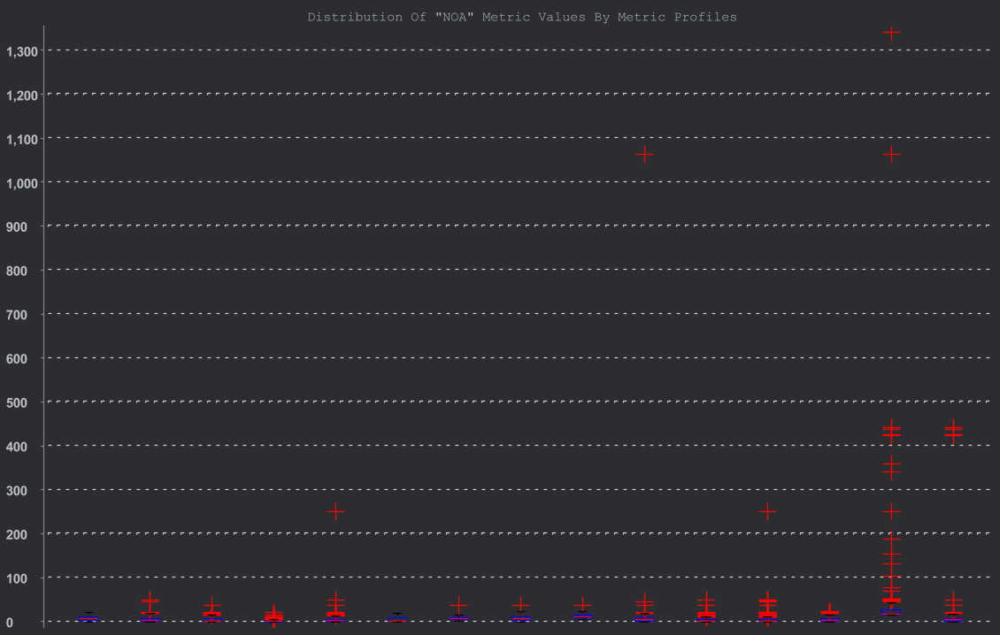
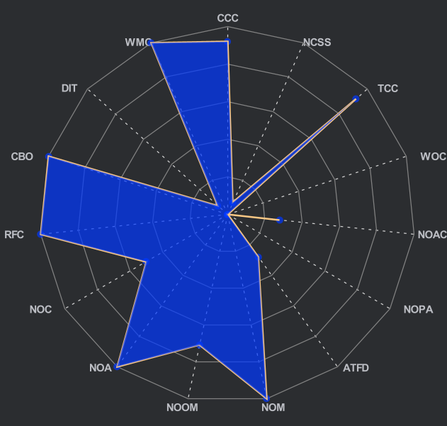
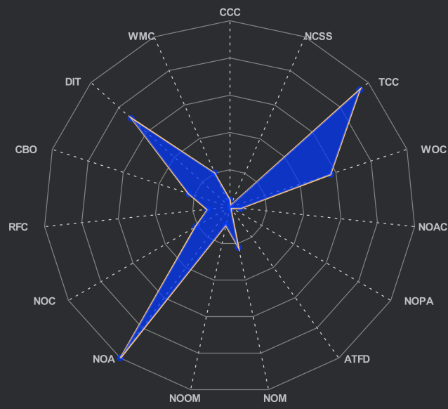
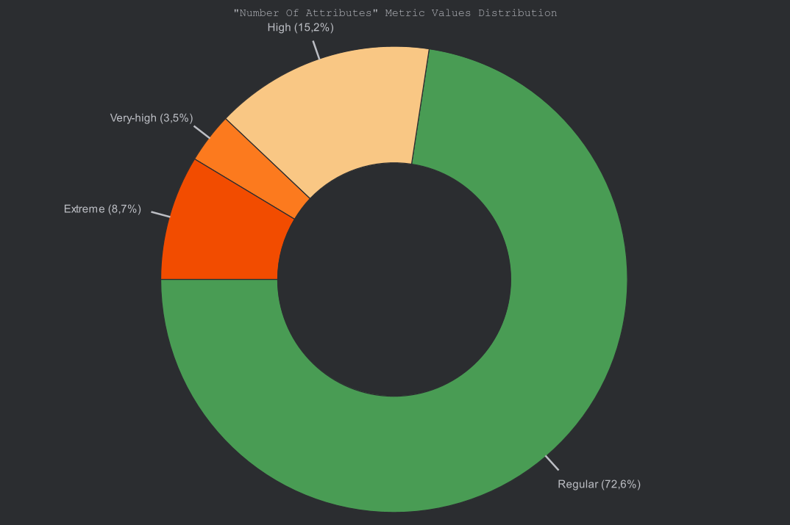
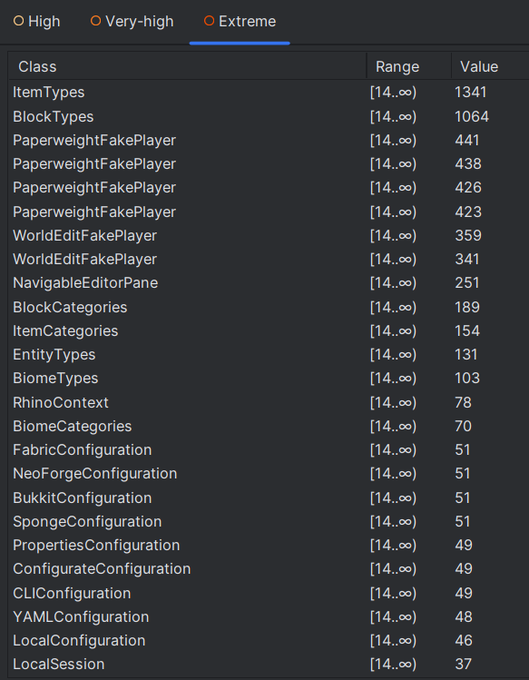
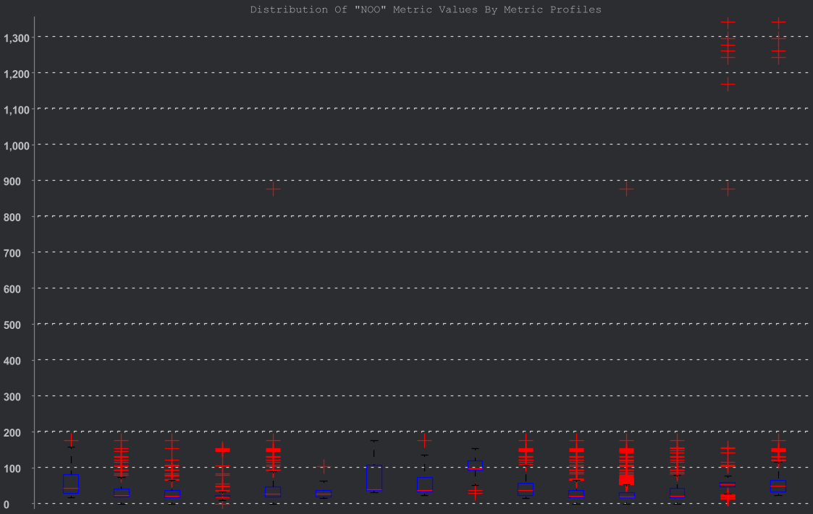
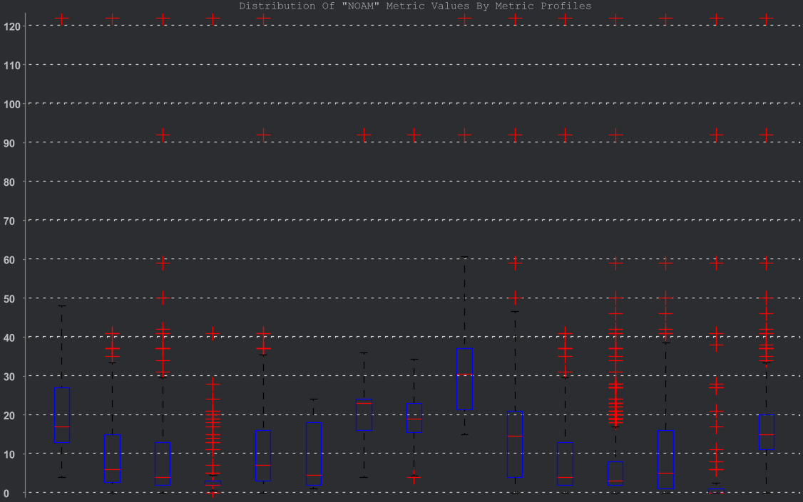
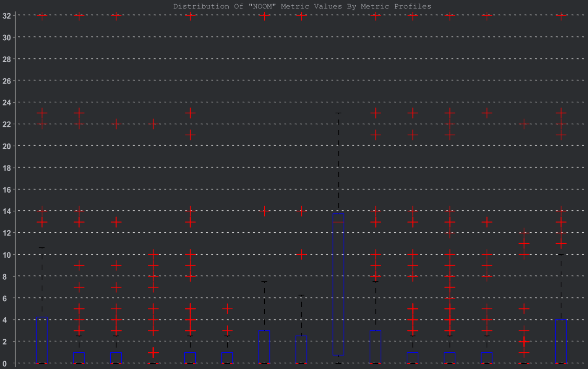
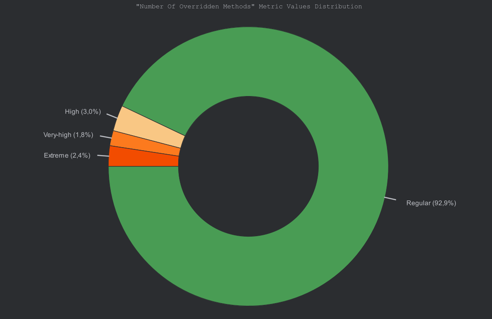
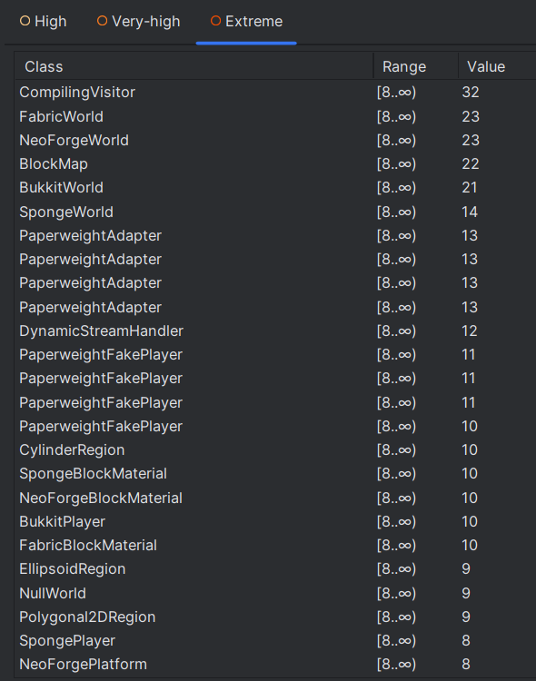

# Lorenz-Kidd metrics set (Class level metrics)

1. [NOA: Number of Attributes](#1-number-of-attributes)
2. [NOO: Number of Operations](#2-number-of-operations)
3. [NOAM: Number of Added Methods](#3-number-of-added-methods)
4. [NOOM: Number of Overridden Methods](#4-number-of-overridden-methods)

## 1. Number of Attributes:

### Charts:

  
fig1 - NOA metric values

  
fig2 - NOA GodClass type 4 correlation chart

  
fig2 - NOA TooManyFields correlation chart

  
fig3 - NOA distribution chart

  
fig4 - NOA distribution chart table

### Potential trouble spots:

### Relation with code smell:

## 2. Number of Operations:

### Charts:

  
fig5 - NOO metric values

### Potential trouble spots:

### Relation with code smell:

## 3. Number of Added Methods:

### Charts:

  
fig6 - NOAM metric values

### Potential trouble spots:

### Relation with code smell:

## 4. Number of Overridden Methods:

### Charts:

  
fig7 - NOOM metric values

  
fig8 - NOOM GodClass type 4 correlation chart

  
fig9 - NOOM distribution chart

  
fig10 - NOOM distribution chart table

### Potential trouble spots:

### Relation with code smell:

