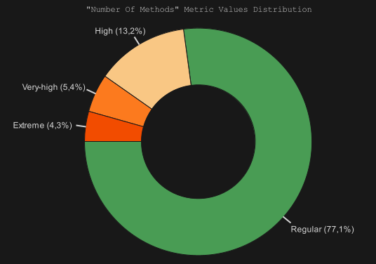
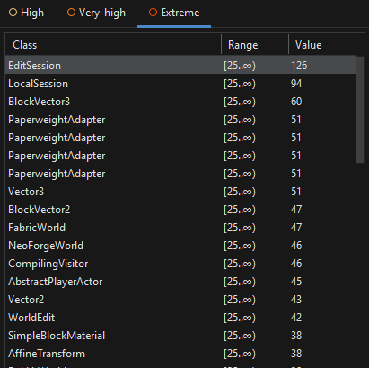
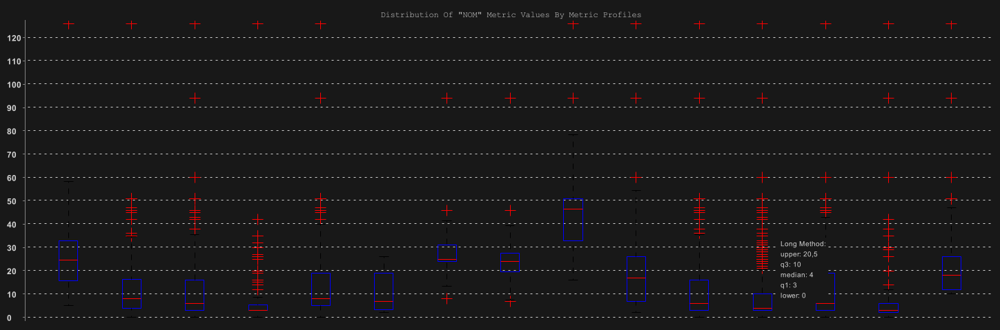
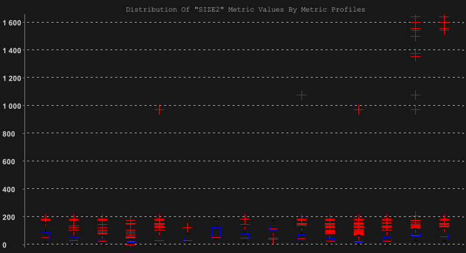
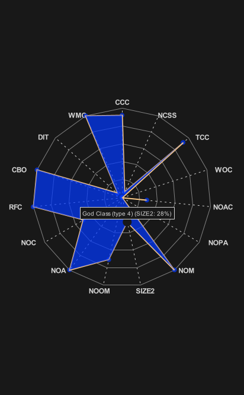
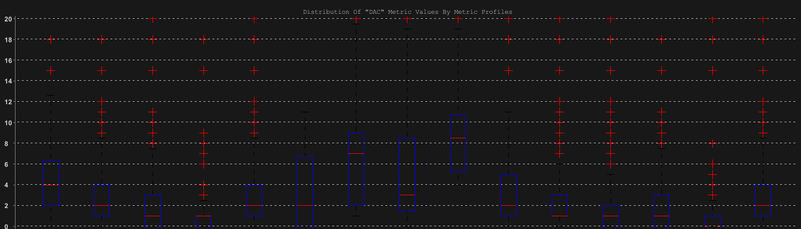

# Li-Henry metrics set (Class level metrics)

1. [NOM: Number of Methods](#1-number-of-methods)
2. [SIZE2: Number of Attributes and Methods](#2-number-of-attributes-and-methods)
3. [DAC: Data Abstraction Coupling](#3-data-abstraction-coupling)

## 1. Number of Methods

The number of methods in a class is a simple metric that provides insight into the size and complexity of a class.  

### Charts:

### Potential trouble spots:

As we can see in the box plot (third image) the metric profile **Long Method** (last four) is the one that has the highest number of outliers, this makes perfect sense because the metric **Number of Methods** counts the number of methods in a class,
and has nothing to do with the number of lines of code in each method. 

### Code Smells:
4,3% of classes have Extreme NOM values, indicating they have a high number of methods.  
The worst three are EditSession with a value of 126, LocalSession with a value of 94 and BlockVector3 with 60.  
This indicates that these classes may be too complex, having most likely the code smell of God Class and too many methods.

## 2. Number of Attributes and Methods

Measures the class size by counting attributes and methods.  

### Charts:

 

### Potential trouble spots:
As we can see in the graph the **too many fields** and **too many methods** (the last to in the graph) are the metrics profile that has a higher number of outliers that are the most fare away of the box,
meaning that the metric SIZE2 is not reliable for this metrics profiles. 
This is probably because the SIZE2 metric is a combination of the number of attributes and methods,
if the metric has a high value manly because of the number of attributes and the number of methods will be low does not make sense basing this value on metrics profile **too many methods** (vice versa for the **too many fields**) 

### Code Smells:
This metric indicates that the classes with high SIZE2 values may have the code smell of God Class. 
As we can see in the spider graph this metric holds a value of 28% percent that compared with the other metrics is the highest value. 

## 3. Data Abstraction Coupling

Measures how much a class depends on other abstract classes. High DAC values suggest high dependencies, which might hinder flexibility.  

### Charts:

legend for the x-axis: 
**Brain Class**,**Brain method**,**Complex Method**, **Deeply Nested Conditions**,**Dispersed Coupling**,**Feature Envy**,**God Class (type 1)**,**God Class (type 3)**,**God Class (type 4)**,**High Coupling**,**Intensive Coupling**,**Long Method**,**Long Parameter List**,**Too Many Fields**,**Too Many Methods** 

### Potential trouble spots:

As we can see in the graph only the metric profiles **Brain Class**,**Feature Envy** and **God Class (type 1,3,4)** are the only ones that have almost non outliers. 
And the rest of the metric profiles have a high number of outliers, this is because this metrics profiles rely mostly on the field, parameters and method counting and method content analysis in which the DAC does not measure. 

### Code Smells:
The classes with high DAC values may have the code smell of Brain Class, Feature Envy and God Class.
- Feature Envy: A high DAC value means that the class is accessing many other classes. If it frequently accesses specific classes, it could be a sign that it "envies" certain features or behaviors of those classes.
- Brain Class: A high DAC value means that the class interacts with many other classes, potentially processing or coordinating data across them.
- God Class: High DAC suggests that this class has dependencies on many other classes, which often happens when it tries to "do everything."

