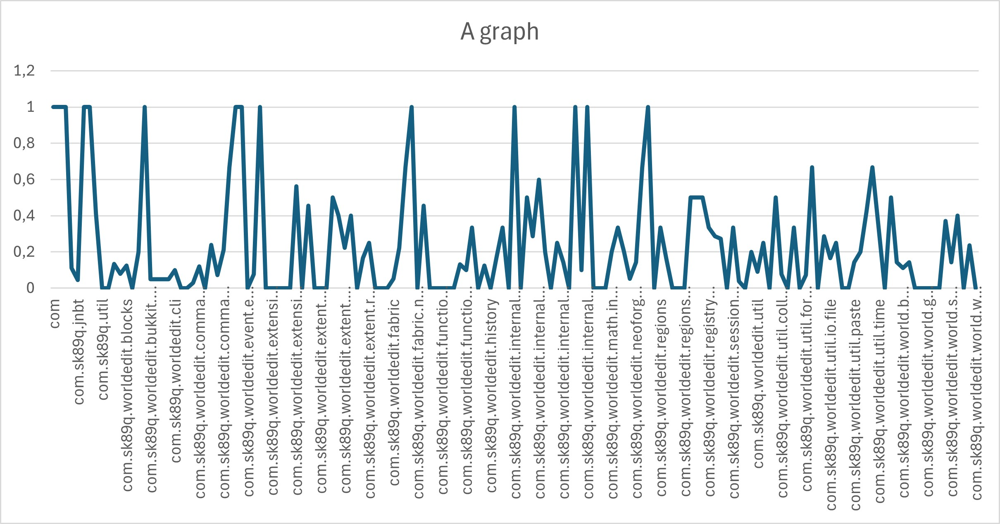
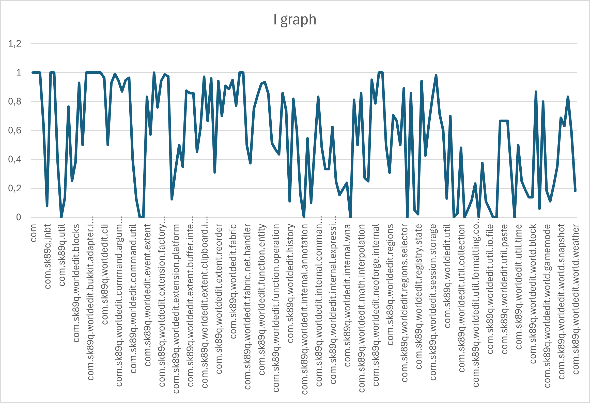
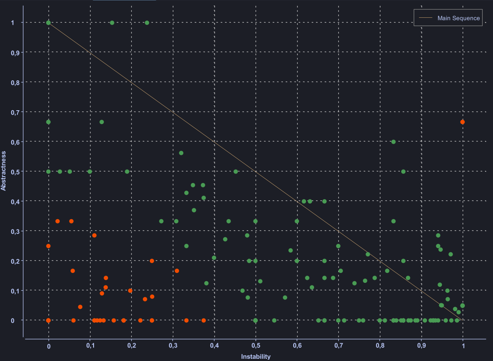

# Robert C. Martin metrics set (Package level metrics)

1. [A: Abstractness](#1-abstractness)
2. [I: Instability](#2-instability)
3. [D: Distance](#3-normalized-distance-from-main-sequence)

## 1. Abstractness

Abstractness (A) is a metric that quantifies the ratio of the number of abstract classes (Na) to the total number
of classes (Nc) in a package.

It varies between 0 and 1, being 0 a package completely concrete and 1 a package completely abstract. 

It is calculated using the formula:

    A = Na / Nc

### Graph:

### Potential trouble spots:

- **High Abstractness**: A high value of Abstractness (A) indicates that the package is highly abstract, with many
abstract classes or interfaces. While this can be beneficial for flexibility and extensibility, it can also lead to over-engineering
and unnecessary complexity if not managed properly. The packages with the highest Abstractness values are the
`com.sk89q.worldedit.extension`, `com.sk89q.worldedit.bukkit.adapter.impl`, `com.sk89q.worldedit.internal.wna`,
`com.sk89q.worldedit.internal.registry`, etc...
- **Low Abstractness**: A low value of Abstractness (A) suggests that the package is concrete, with few abstract
classes. This can make the package rigid and less adaptable to change, as it may lack the necessary abstractions
to support future modifications. The packages with the lowest Abstractness values are the `com.sk89q.util`, `com.sk89q.worldedit.math`,
`com.sk89q.worldedit.util.asset.holder`, `com.sk89q.worldedit.util.concurrency`, etc...

### Relation with code smells:

- **High Abstractness**: A high Abstractness value can sometimes indicate the presence of **Speculative Generality**,
where classes are overly abstract and provide unnecessary abstractions that are not currently needed, they are
"just in case" abstractions. This can lead to unnecessary complexity and make the code harder to understand and maintain.
It can also lead to **Zones of Uselessness**, that's when a highly abstract package is not widely used or implemented,
meaning it provides abstraction with little practical application.
- **Low Abstractness**: A low Abstractness value may suggest **Rigidity**, where the package lacks the necessary
abstractions to support future changes. This can lead to code that is difficult to extend or modify without
significant refactoring. Also, may lead to **Duplicate Code**, as concrete classes may repeat similar logic.

## 2. Instability

Instability (I) is a metric that quantifies the ratio of efferent couplings (Ce) to the sum of efferent couplings
(Ce) and afferent couplings (Ca) in a package.

Efferent Coupling (Ce) is the number of classes outside the package that
depend on classes within the package, as each class counts only once. Afferent Coupling (Ca) is the opposite, the number
of classes inside the package that depend on classes outside the package, and as in Ce, each class counts only once. 

Instability varies between 0 and 1, with 0 indicating a stable package that is not dependent
on others and 1 indicating an unstable package that is highly dependent on others.

It is calculated using the formula:

    I = Ce / (Ce + Ca)

### Graph:

### Potential trouble spots:

- **High Instability**: A high value of Instability (I) indicates that the package is unstable, with many dependencies
on classes outside the package. This can make the package more prone to changes in external classes and can
lead to a higher risk of bugs and errors. The packages more unstable are `com.sk89q.worldedit.extension`,
`com.sk89q.worldedit.bukkit.adapter.impl`, `com.sk89q.worldedit.fabric.mixin`, etc...
- **Low Instability**: A low value of Instability (I) suggests that the package is stable, with few dependencies on
classes outside the package. This can make the package more resilient to changes in external classes and can
reduce the risk of bugs and errors, however, it can also lead to a lack of flexibility and adaptability. 
The most stable packages are `com.sk89q.util`, `com.sk89q.worldedit.math`, `com.sk89q.worldedit.internal.annotation`, etc...

### Relation with code smells:

- **High Instability**: A high Instability value can indicate **Rigidity**, where the package is highly dependent on
external classes and is more likely to break when external classes change. This can make the package difficult to
maintain and extend. It can also lead to **Shotgun Surgery**, where changes in external classes require many
modifications across the package.
- **Low Instability**: A low Instability value can suggest **Fragility**, where the package is not well integrated with
external classes and may not function correctly when external classes change. This can lead to bugs and errors
that are difficult to diagnose and fix.

## 3. Normalized Distance from Main Sequence

Normalized Distance from Main Sequence or just Distance (D) is a metric that quantifies the distance of a package from the
main sequence, which is a line that goes from the point (0,1) to the point (1,0) in the Abstractness-Instability
graph. The main sequence represents the ideal balance between Abstractness and Instability, with packages close to it
being well-balanced in terms of these two metrics. Basically, a highly unstable package should be highly abstract to
avoid being too dependent on other packages, while a highly stable package should be highly concrete to avoid
unnecessary complexity.

It is calculated using the formula:

    D = |A + I - 1|

The ideal D is 0, i.e. `A = 1 - I`, which means that the package is perfectly balanced in terms of Abstractness and Instability.

### Chart:

Analysing the chart, we can see that the majority of the packages are close to the main sequence, but are more unstable
than abstract. Inclusive, we have a big part of the packages in the bottom-left quadrant, which means that the main
problems related to rigidity in the project are there.

### Potential trouble spots:

- **High Distance**: A high value of Distance (D) indicates that the package is far from the main sequence, which
means that it is either highly abstract and unstable (top-right corner) or highly concrete and stable (bottom-left)
corner). Both of these extremes can lead to many issues such as over-engineering, under-engineering, or unnecessary
complexity. The packages with the highest Distance values are the `com.sk89q.util`, `com.sk89q.worldedit.extension`,
`com.sk89q.worldedit.math`, `com.sk89q.worldedit.bukkit.adapter.impl`, `com.sk89q.worldedit.fabric.net`, etc...

### Relation with code smells:

- **High Distance**: A high Distance value should indicate some code smells related to excessive volatility or rigidity
in a package's design.
  - **highly concrete and stable packages**: may indicate **Rigidity**, where the package is not flexible enough to
  support future changes. This creates a **Zone of Pain**, zones where is difficult to modify the classes because
  they have many incoming dependencies (Ca is high) but are not abstract, so modifications to these concrete
  classes ripple throughout the system.
  - **highly abstract and unstable packages**: may indicate **Fragility**, where the package is too dependent on
  external classes and is more likely to break when external classes change. This can lead to **Shotgun Surgery**,
  where changes in external classes require many modifications across the package. We may have **Speculative Generality**
  too, where classes are overly abstract and provide unnecessary abstractions that are not currently needed and create
  **Zones of Uselessness**, where the package provides abstraction with little practical application.