# Chidamber-Kemerer metrics set (Class level metrics)

1. [WMC: Weighted methods per class](#1-weighted-methods-per-class)
2. [DIT: Depth of Inheritance Tree](#2-depth-of-inheritance-tree)
3. [NOC: Number of Children](#3-number-of-children)
4. [CBO: Coupling between object classes](#4-coupling-between-object-classes)
5. [RFC: Response for a Class](#5-response-for-a-class)

## 1. Weighted methods per class:

A weighted sum of methods implemented within a class. It is parameterized by a way to compute the weight of each method.  
It provides insight into how complex or "heavy" a class is, which can influence its readability, maintainability, and potential code quality issues.

### Charts:

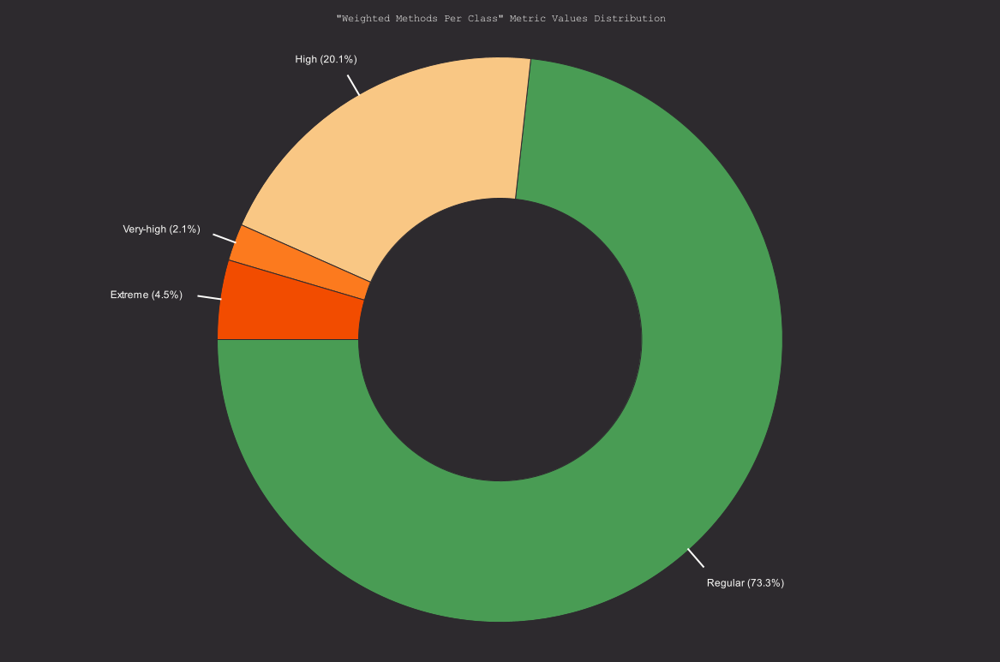

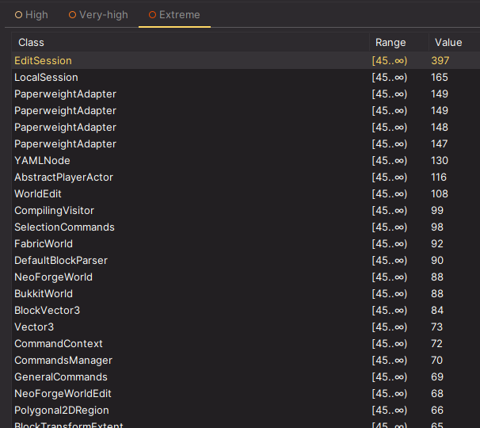

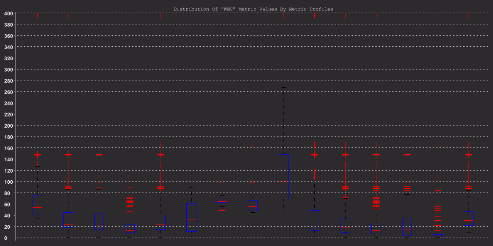

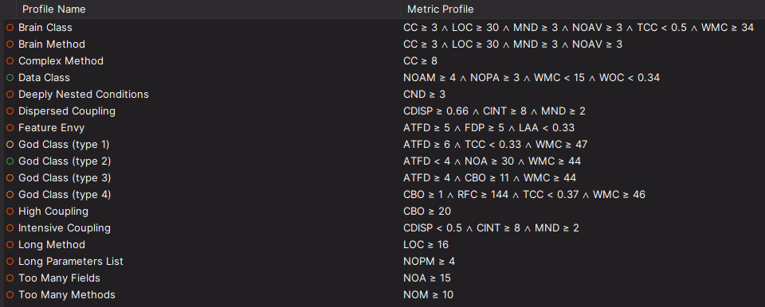

### Potential trouble spots:

A notable **4.5% of classes have "Extreme" WMC values**, indicating they are highly complex and potentially overloaded with responsibilities. These classes are at risk of becoming **God Classes** or having multiple responsibilities, which can lead to maintenance issues, difficulty in testing, and reduced code readability.  
The most obvious case is the `EditSession` class, located in the `com.sk89q.worldedit` package, with a WMC of 397.  
The boxplot chart outliers also suggest potential violations of the **Single Responsibility Principle**, as classes may be overloaded with responsibilities, contributing to their high WMC scores.  

### Relation with code smell:

A WMC of 397 indicates that the `EditSession` class has a very high number of methods, contributing to its complexity and lack of cohesion. This high WMC score is typical of a **God Class** because it suggests that `EditSession` is doing too much on its own, handling numerous responsibilities that should ideally be distributed across multiple, smaller classes.  

## 2. Depth of Inheritance Tree:

The maximum length of a path from a class to a root class in the inheritance structure of a system. DIT measures how many super-classes can affect a class.  
This metric is used to assess the complexity of a class's inheritance structure and can provide insight into potential design issues or benefits.

### Charts:

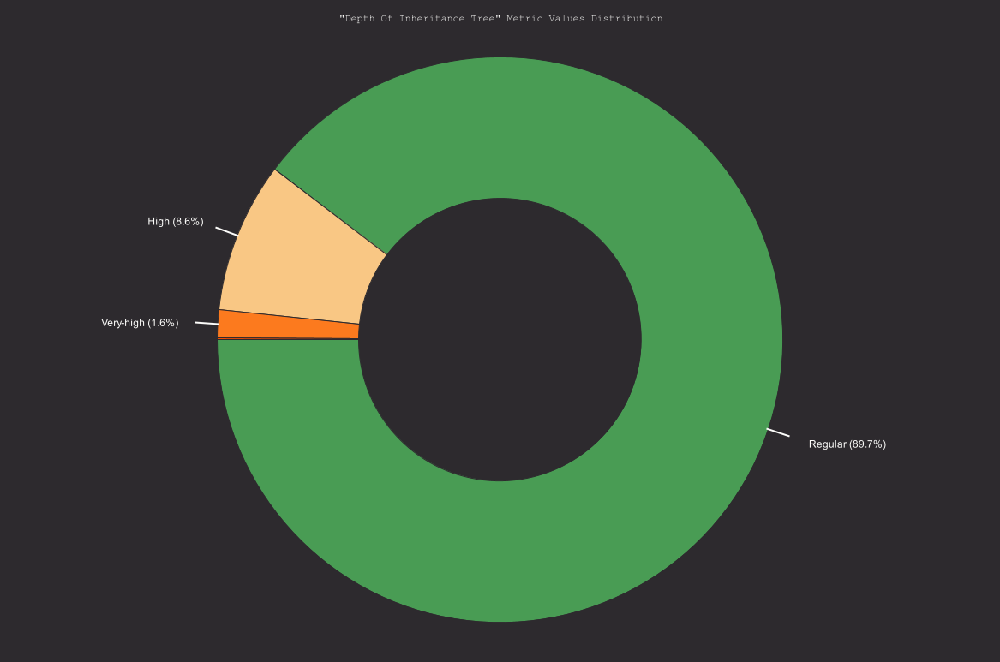

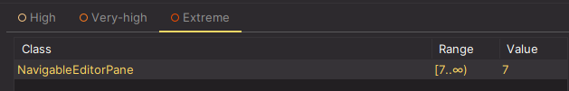

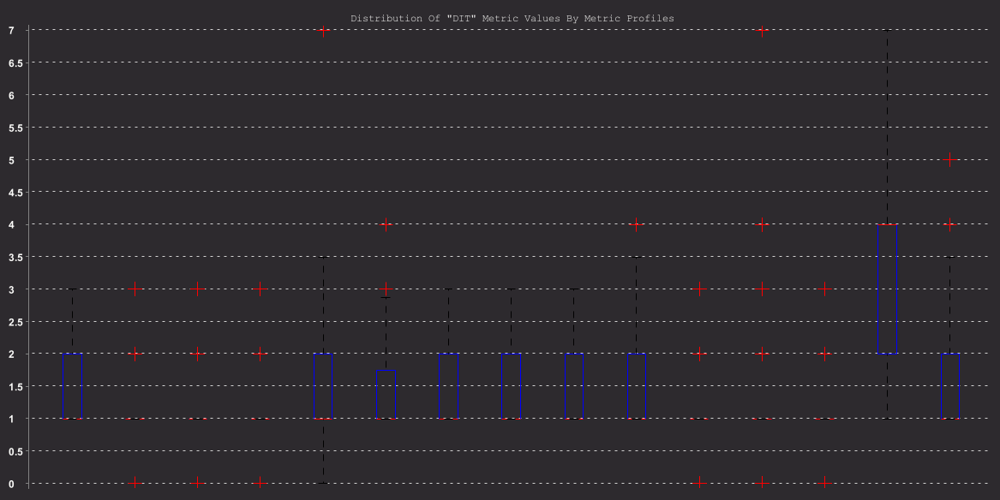

### Potential trouble spots:

**High DIT** can indicate over-reliance on inheritance, which can lead to rigidity in the code and difficulty in maintaining or extending it.  
The only extreme case is the `NavigableEditorPane` private class located inside the `InfoEntryPoint` in the `com.sk89q.worldedit.internal.util` package, with a DIT of 7.  
In the boxplot chart, the **Long Method** profile stands out with a significant number of high outliers. This suggests that these classes are not only lengthy in terms of lines of code or complexity within individual methods, but they may also be embedded in deep inheritance chains.

## 3. Number of Children:

Calculates the total number of direct subclasses of given class. This metric measures how many sub-classes are going to inherit the methods of the parent class.  
The size of NOC approximately indicates the level of reuse in an application. If NOC grows it means reuse increases.  
On the other hand, as NOC increases, the amount of testing will also increase because more children in a class indicate more responsibility. So, NOC represents the effort required to test the class and reuse.

### Charts:

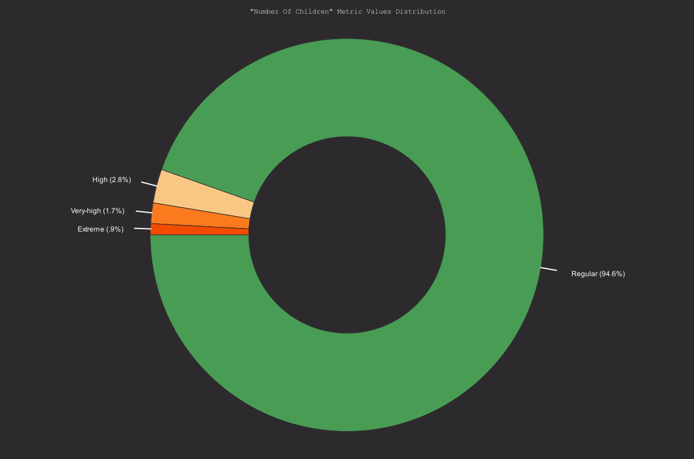

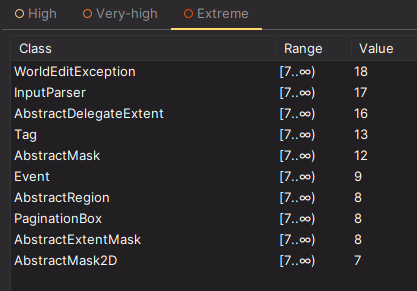

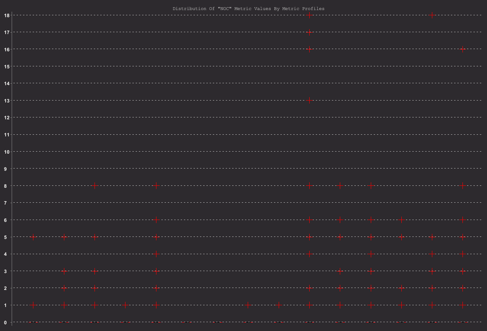

### Potential trouble spots:

**Extremely high NOC** values may indicate over-reliance on a single base class, which could make maintenance more challenging. The tables shows some extreme values, being the worst one the `WorldEditException` abstract class located in the `com.sk89q.worldedit` package, with a NOC of 18.  
In the donut chart, the **High Coupling** profile, having the most highest outliers, aligns with the idea that high coupling can result in complex interdependencies, potentially leading to a sprawling inheritance structure where classes depend on numerous other classes. This can make the system harder to maintain and increase the risk of rigidity, as changes in one class may propagate across many child classes.

## 4. Coupling between object classes:

Is the number of other classes that a class is coupled to. It measures the degree of dependency between classes.  
Specifically, it counts the number of distinct classes a class depends on or uses in some way (e.g., through method calls, class instances, or inheritance).  
The CBO metric helps assess the maintainability and complexity of a class by highlighting its dependencies. Generally, keeping coupling low is recommended to improve modularity, flexibility, and ease of maintenance.

### Charts:

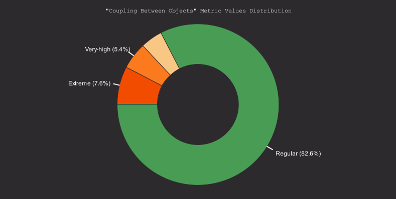

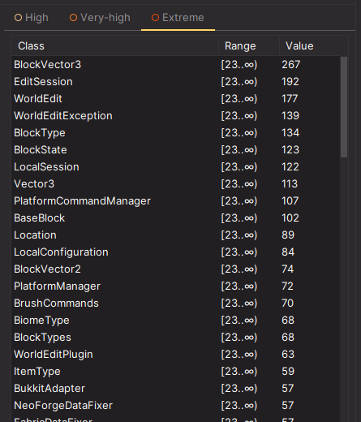

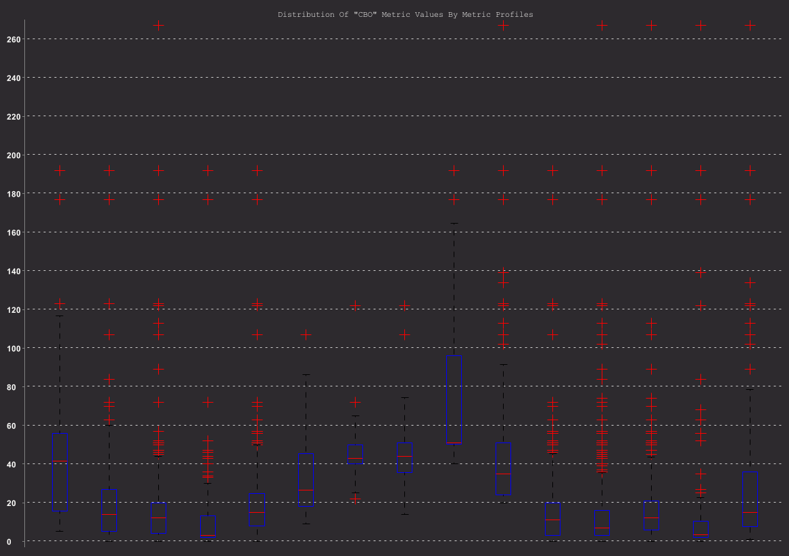

### Potential trouble spots:

**High CBO** indicates that a class depends on many others, which makes it more complex and harder to maintain. Such high dependency reduces modularity and flexibility, as changes in one class can easily ripple across others, leading to unintended side effects. Additionally, it hinders reusability, as highly coupled classes are difficult to adapt or move to new contexts without also including their dependencies.  
The most extreme case being the `BlockVector3` record in the `com.sk89q.worldedit.math` package, with a CBO of 267.  
The boxplot chart shows that **Complex Method** and **Long Method** profiles have the most outliers, indicating high coupling. For Complex Methods, high CBO suggests interactions with many classes, increasing complexity and potential maintenance issues. For Long Methods, high coupling with external classes complicates the structure and makes refactoring harder. 

## 5. Response for a Class:

Is the total number of methods that can potentially be executed in response to a message received by an object of a class. This number is the sum of the methods of the class, and all distinct methods are invoked directly within the class methods.  
Additionally, inherited methods are counted, but overridden methods are not, because only one method of a particular signature will always be available to an object of a given class.

### Charts:

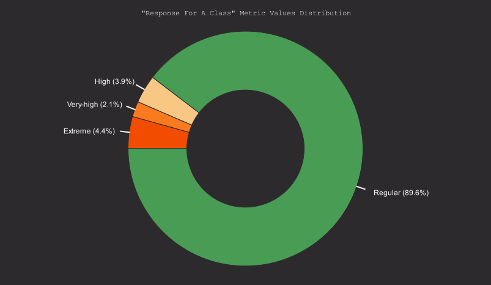

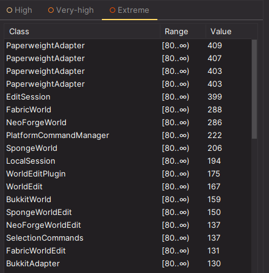

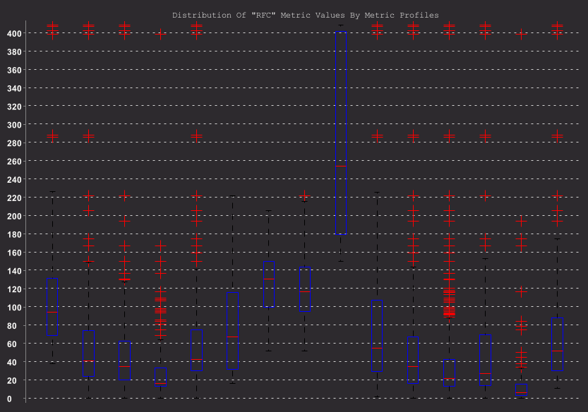

### Potential trouble spots:

**High RFC** values can lead to difficult maintenance and testing, as these classes are more interconnected and harder to isolate.  
The worst case seem to be the `PaperweightAdapter` class, in the `com.sk89q.worldedit.bukkit.adapter.impl.v1_20_R4` package, with a RFC of 409.  
The boxplot chart shows that the **Long Method** profile has the most outliers, with RFC values significantly exceeding the typical range. This indicates that classes associated with this profile tend to have a large number of method calls or complex interactions within methods, aligning with the characteristics of a long method code smell. Such high RFC values suggest that these methods are likely doing too much or interacting extensively with other components, which can lead to maintenance difficulties and reduced modularity.

### Relation with code smell:

The **high Response for Class (RFC) value of 194** in `LocalSession` suggests it's doing too much and relies heavily on methods from other classes, especially `EditSession`. This reliance reflects the **Feature Envy** smell, as `LocalSession` frequently accesses external methods, indicating it's overextended and lacks cohesion.
