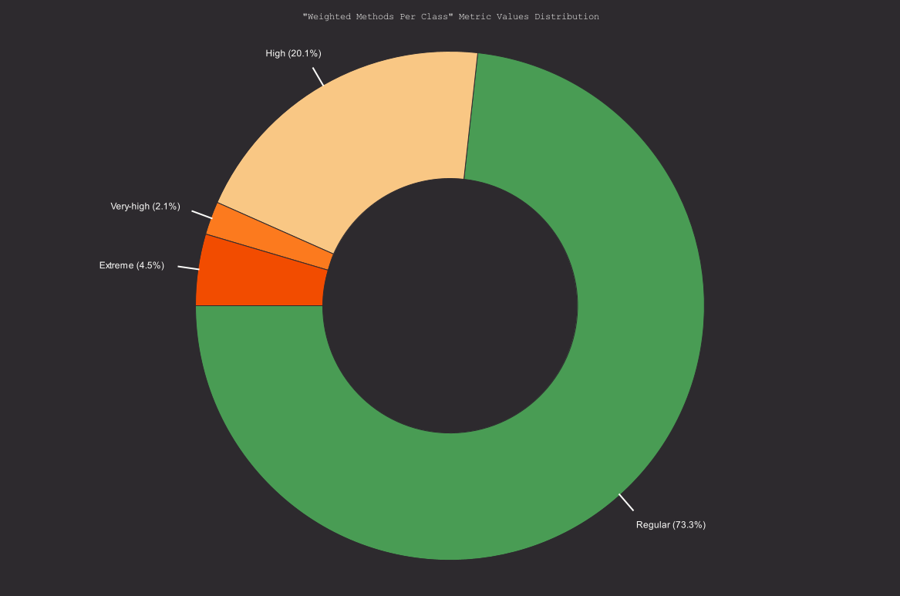
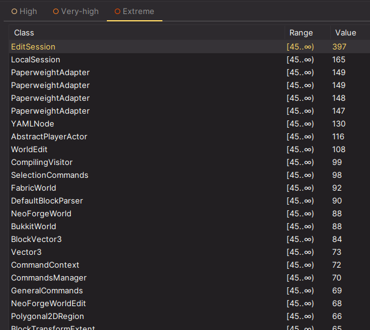
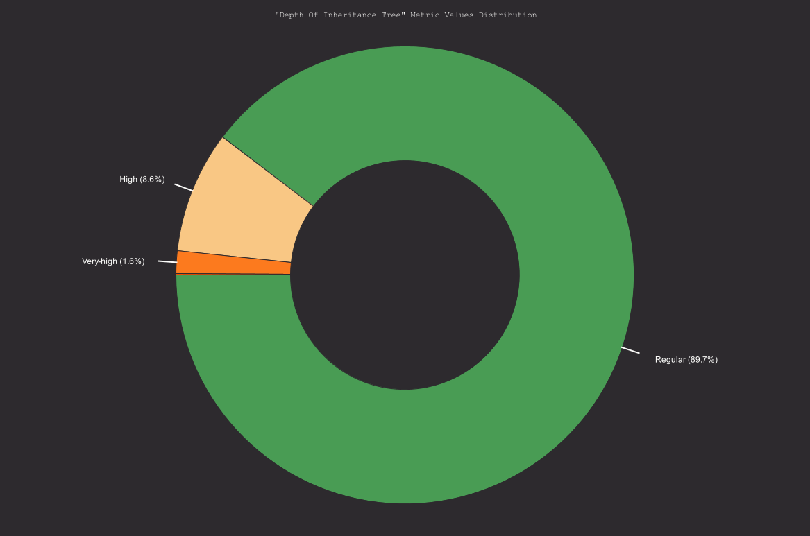
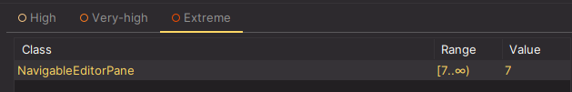
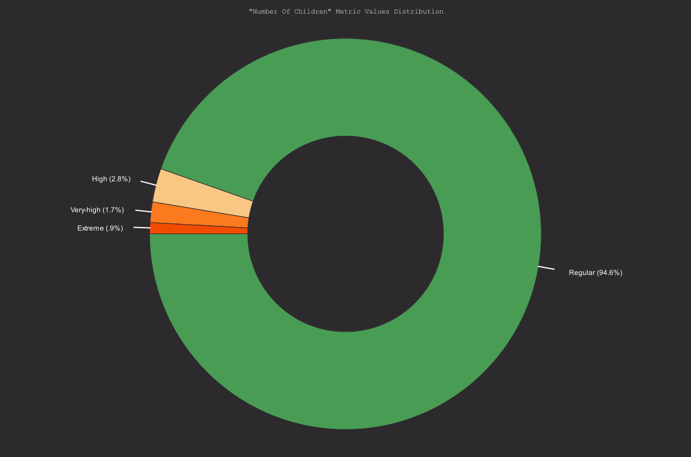
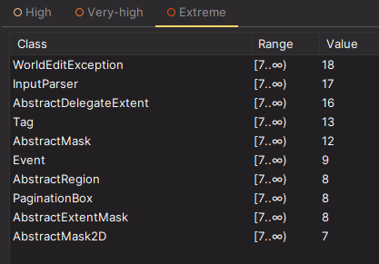

# Chidamber-Kemerer metrics set (Class level metrics)

1. [WMC: Weighted methods per class](#1-weighted-methods-per-class)
2. [DIT: Depth of Inheritance Tree](#2-depth-of-inheritance-tree)
3. [NOC: Number of Children](#3-number-of-children)
4. CBO: Coupling between object classes
5. RFC: Response for a Class
6. LCOM: Lack of cohesion in methods

## 1. Weighted methods per class:

A weighted sum of methods implemented within a class. It is parameterized by a way to compute the weight of each method.  
It provides insight into how complex or "heavy" a class is, which can influence its readability, maintainability, and potential code quality issues.

### Chart:

### Potential trouble spots:

**High WMC:** Suggests a class with many complex methods, which may be harder to understand and maintain.  
Based on the chart, we can see some classes with extreme WMC, being the most obvious case the `EditSession` class located in the `com.sk89q.worldedit` package, with a WMC of 397.

### Relation with code smell:

TODO

## 2. Depth of Inheritance Tree:

The maximum length of a path from a class to a root class in the inheritance structure of a system. DIT measures how many super-classes can affect a class.  
This metric is used to assess the complexity of a class's inheritance structure and can provide insight into potential design issues or benefits.

### Chart:

### Potential trouble spots:

The only extreme case is the `NavigableEditorPane` private class located inside the `InfoEntryPoint` in the `com.sk89q.worldedit.internal.util` package, with a DIT of 7.

**High DIT** implies:

- **Higher Complexity:** A deeper hierarchy makes classes harder to understand and maintain due to multiple inherited behaviors.
- **Behavioral Complexity:** More inherited methods and properties can obscure the functionality of a class.
- **Increased Reusability:** High DIT may reflect a well-designed, reusable structure, especially in frameworks.
- **Risk of Fragility:** Changes in high-level classes can have cascading effects on many subclasses, making the codebase fragile.

## 3. Number of Children:

Calculates the total number of direct subclasses of given class. This metric measures how many sub-classes are going to inherit the methods of the parent class.  
The size of NOC approximately indicates the level of reuse in an application. If NOC grows it means reuse increases.  
On the other hand, as NOC increases, the amount of testing will also increase because more children in a class indicate more responsibility. So, NOC represents the effort required to test the class and reuse.

### Chart:

### Potential trouble spots:

