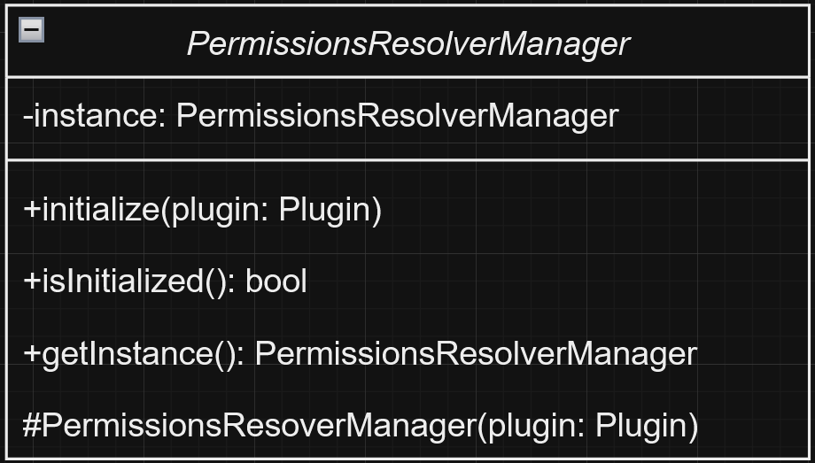

# Design Pattern 1 (Singleton)

## 1. Code snippet:

### PermissionsResolverManager.java
    public class PermissionsResolverManager implements PermissionsResolver {

    // Other variables

    private static PermissionsResolverManager instance;

    // Initializes the PermissionsResolverManager instance
    public static void initialize(Plugin plugin) {
        if (!isInitialized()) {
            instance = new PermissionsResolverManager(plugin);
        }
    }

    // Checks if the class is initialized to prevent creation of multiple instances
    public static boolean isInitialized() {
        return instance != null;
    }

    // Other methods

    }

## 2. Class diagram:

## 3. Location on the codebase:

- **Package:** `com.sk89q.wepif`
- **Class:** `PermissionsResolverManager`
- **Fields and Methods:**
    - `private static PermissionsResolverManager instance` : Singleton instance.
    - `public static void initialize(Plugin plugin)` : Initializes the singleton instance.
    - `public static boolean isInitialized()` : Checks if the class is initialized.

## 4. Discussion:

This implementation demonstrates the **Singleton pattern** by ensuring that only one instance of
`PermissionsResolverManager` exists throughout the application. The `PermissionsResolverManager`
class contains a private static variable `instance` that holds the single instance of the class.
The `initialize` method checks if the instance is already created using the `isInitialized` method,
and if not, it creates a new instance. This prevents the creation of multiple instances and ensures
that the same instance is used across the application. This design pattern is useful for managing shared
resources or configurations in a centralized manner.

# Design Pattern 2 (Adapter)

## 1. Code snippet:

### WorldEditFakePlayer.java

    public class WorldEditFakePlayer extends ServerPlayer {
        
    // Static fields

    public WorldEditFakePlayer(ServerLevel world) {
        super(world.getServer(), world, FAKE_WORLDEDIT_PROFILE, FAKE_CLIENT_INFO);
    }

    // Other methods and fields

    @Override
    public void displayClientMessage(Component message, boolean actionBar) {
        super.displayClientMessage(message, actionBar);
    }

    @Override
    public boolean isInvulnerableTo(DamageSource damageSource) {
        return true;
    } 
  
    }

## 2. Class diagram:

## 3. Location on the codebase:

- **Package:** `com.sk89q.worldedit.fabric`
- **Class:** `WorldEditFakePlayer`
- **Fields and Methods:**
  - `public WorldEditFakePlayer(ServerLevel world)`: Constructor that initializes the fake player.
  - `@Override public void displayClientMessage(Component message, boolean actionBar)`: Displays a client message.
  - `@Override public boolean isInvulnerableTo(DamageSource damageSource)`: Checks if the player is invulnerable to a specific damage source.

## 4. Discussion:

This implementation demonstrates the **Adapter pattern** by allowing `WorldEditFakePlayer` to act as an adapter between 
the `ServerPlayer` class and the WorldEdit functionality. The `WorldEditFakePlayer` class extends `ServerPlayer` and 
overrides specific methods to adapt the behavior to fit the needs of WorldEdit.

For example, the `displayClientMessage` method is overridden to display messages to the client, and the 
`isInvulnerableTo` method is overridden to make the player invulnerable to certain damage sources. 
This allows the `WorldEditFakePlayer` to integrate seamlessly with the existing `ServerPlayer` class while 
providing additional functionality required by WorldEdit.

By using the Adapter pattern, the `WorldEditFakePlayer` can leverage the existing `ServerPlayer` functionality and 
extend it without modifying the original class. This promotes code reuse and flexibility, making it easier to maintain 
and extend the application.

# Design Pattern 3 (Factory)

## 1. Code snippet:

### FeatureGeneratorFactory.java

    public final class FeatureGeneratorFactory implements Contextual<RegionMaskingFilter> {
    private final ConfiguredFeatureType type;
    private final double density;

    public FeatureGeneratorFactory(ConfiguredFeatureType type, double density) {
        this.type = type;
        this.density = density;
    }

    @Override
    public RegionMaskingFilter createFromContext(EditContext input) {
        return new RegionMaskingFilter(
            new NoiseFilter(new RandomNoise(), this.density),
            new FeatureGenerator((EditSession) input.getDestination(), this.type)
        );
    }

    @Override
    public String toString() {
        return "feature of type " + type;
    }
    }

## 2. Class diagram:

## 3. Location on the codebase:

- **Package:** `com.sk89q.worldedit.command.factory`
- **Class:** `FeatureGeneratorFactory`
- **Fields and Methods:** 
  - `public FeatureGeneratorFactory(ConfiguredFeatureType type, double density)`: Constructor that initializes the factory with a feature type and density.
  - `@Override public RegionMaskingFilter createFromContext(EditContext input)`: Creates a `RegionMaskingFilter` based on the context.
  - `@Override public String toString()`: Returns a string representation of the factory.

## 4. Discussion:

This implementation demonstrates the **Factory pattern** by providing a way to create objects without specifying the 
exact class of object that will be created. The `FeatureGeneratorFactory` class encapsulates the creation of 
`RegionMaskingFilter` objects, which are configured with a `NoiseFilter` and a `FeatureGenerator`.

The `createFromContext` method takes an `EditContext` as input and uses it to create a new `RegionMaskingFilter` 
instance. This method abstracts the instantiation logic, allowing the client code to create `RegionMaskingFilter` 
objects without knowing the details of their construction.

By using the Factory pattern, the `FeatureGeneratorFactory` promotes loose coupling and enhances flexibility.
It allows the creation logic to be centralized in one place, making it easier to manage and extend. 
This design pattern is particularly useful when the creation process is complex or when the specific type of object to 
be created is determined at runtime.