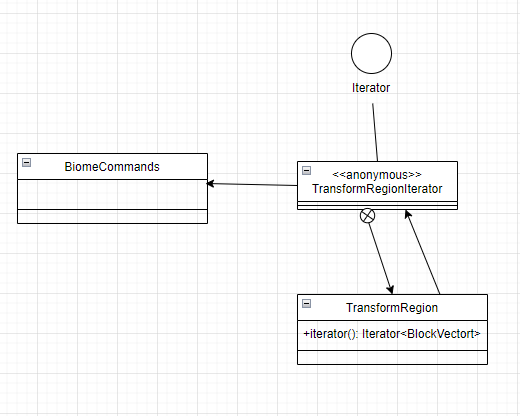
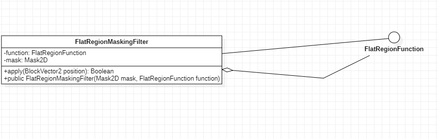

# Design Pattern 1 (Factory Method)

## 1. Code snippet:
    private Property<?> createProperty(String type, String key, List<String> values) {
        return switch (type) {
            case "int" -> new IntegerProperty(key, values.stream().map(Integer::parseInt).toList());
            case "bool" -> new BooleanProperty(key, values.stream().map(Boolean::parseBoolean).toList());
            case "enum" -> new EnumProperty(key, values);
            case "direction" ->
                new DirectionalProperty(key, values.stream().map(String::toUpperCase).map(Direction::valueOf).toList());
            default -> throw new RuntimeException("Failed to create property");
        };
    }

## 2. Class diagram:

## 3. Location on the codebase:

- **Package:** `com.sk89q.worldedit.cli`
- **Class:** `CLIBlockRegistry`
- **Fields and Methods:**
    - `private createProperty(String type, String key, List<String> values)` : Method gives a Property object based on the type. 

## 4. Discussion:
 The Factory Method pattern is used here to create a Property object based on the argument `type`.  
 The correct product implementations are selected in the switch statement.  

# Design Pattern 2 (Iterator)

## 1. Code snippet:
    @Override
    public Iterator<BlockVector3> iterator() {
        final Iterator<BlockVector3> it = region.iterator();

        return new Iterator<BlockVector3>() {
            @Override
            public boolean hasNext() {
                return it.hasNext();
            }

            @Override
            public BlockVector3 next() {
                BlockVector3 next = it.next();
                if (next != null) {
                    return transform.apply(next.toVector3()).toBlockPoint();
                } else {
                    return null;
                }
            }

            @Override
            public void remove() {
                it.remove();
            }
        };
    }

## 2. Class diagram:

## 3. Location on the codebase:

- **Package:** `com.sk89q.worldedit.regions`
- **Class:** `TransformRegion`
- **Fields and Methods:**
    - `public Iterator<BlockVector3> iterator()` : Method returns an Iterator of BlockVector3 objects.

## 4. Discussion:
    The Iterator pattern is used here to iterate over the elements in the region while transforming them. 

# Design Pattern 3 (Decorator)

## 1. Code snippet:

    public class FlatRegionMaskingFilter implements FlatRegionFunction {
    
        private final FlatRegionFunction function;
        private final Mask2D mask;
    
        public FlatRegionMaskingFilter(Mask2D mask, FlatRegionFunction function) {
            checkNotNull(function);
            checkNotNull(mask);
    
            this.mask = mask;
            this.function = function;
        }
    
        @Override
        public boolean apply(BlockVector2 position) throws WorldEditException {
            return mask.test(position) && function.apply(position);
        }
    }

## 2. Class diagram:

## 3. Location on the codebase:

- **Package:** `com.sk89q.worldedit.function`
- **Class:** `FlatRegenMaskingFilter`
- **Fields and Methods:**
    - `public boolean apply(BloackVector2 position) throws WolrdEditException` : Method applies the mask and function to the position.
    - `public FlatRegionMaskingFilter(Mask2D mask, FlatRegionFunction function)` : Constructor for the class.
    - `private final FlatRegionFunction function` : Field for the function to be applied.
    - `private final Mask2D mask` : Field for the mask to be applied.

## 4. Discussion:
    This class is a decorator because implements the same interface as the attribute `function` and adds the functionality of the `mask` to the `function`. 

