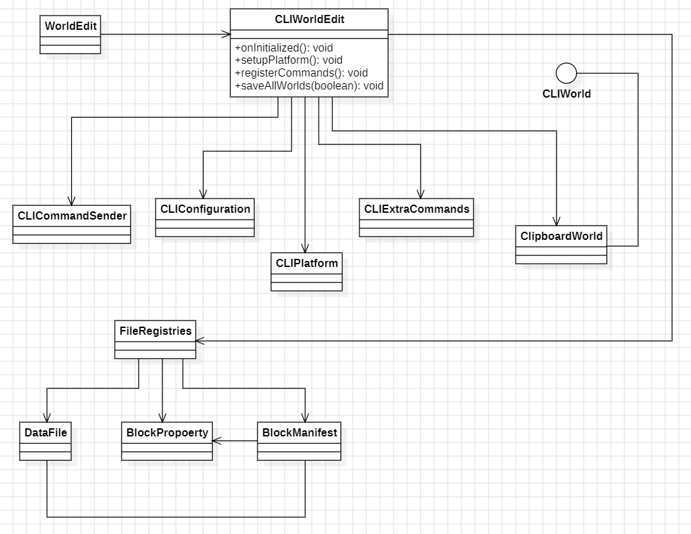

# Design Pattern 1 (Facade Pattern)

## 1. Code snippet:

    public class CLIWorldEdit {

        //...
    
        private void setupPlatform() {
            WorldEdit.getInstance().getPlatformManager().register(platform);
    
            registerCommands();
    
            config = new CLIConfiguration(this);
    
            // There's no other platforms, so fire this immediately
            WorldEdit.getInstance().getEventBus().post(new PlatformsRegisteredEvent());
    
            this.fileRegistries = new FileRegistries(this);
            this.fileRegistries.loadDataFiles();
        }
    
        private void registerCommands() {
            PlatformCommandManager pcm = WorldEdit.getInstance().getPlatformManager()
                .getPlatformCommandManager();
            pcm.registerSubCommands(
                "cli",
                ImmutableList.of(),
                "CLI-specific commands",
                CLIExtraCommandsRegistration.builder(),
                new CLIExtraCommands()
            );
        }
    
        //...
    
        public void onInitialized() {
            // Setup working directory
            workingDir = Paths.get("worldedit");
            if (!Files.exists(workingDir)) {
                try {
                    Files.createDirectory(workingDir);
                } catch (IOException e) {
                    throw new UncheckedIOException(e);
                }
            }
    
            this.commandSender = new CLICommandSender(this, LOGGER);
            this.platform = new CLIPlatform(this);
            LOGGER.info("WorldEdit CLI (version " + getInternalVersion() + ") is loaded");
        }
    
        //...
    
         public void run(InputStream inputStream) {
            try (Scanner scanner = new Scanner(inputStream)) {
                while (true) {
                    System.err.print("> ");
                    if (!scanner.hasNextLine()) {
                        break;
                    }
                    String line = scanner.nextLine();
                    if (line.isEmpty()) {
                        continue;
                    }
                    if (line.equals("stop")) {
                        commandSender.printInfo(TranslatableComponent.of("worldedit.cli.stopping"));
                        break;
                    }
                    CommandEvent event = new CommandEvent(commandSender, line);
                    WorldEdit.getInstance().getEventBus().post(event);
                    if (!event.isCancelled()) {
                        commandSender.printError(TranslatableComponent.of("worldedit.cli.unknown-command"));
                    } else {
                        saveAllWorlds(false);
                    }
                }
            } finally {
                saveAllWorlds(false);
            }
        }

        /...
    }

## 2. Class diagram:

## 3. Location on the codebase:

**Package:** `com.sl89q.worldedit.cli`

**Class:** `CLIWorldEdit`

**Fields and Methods:** ...

## 4. Discussion:

The facade pattern is used to simplify interactions with the WorldEdit
subsystem and hide his complexity. Simplify operations like initialization and setup,
command registration, event handling and subsystem management.

# Design Pattern 2 (...)

## 1. Code snippet:

    ...

## 2. Class diagram:

    ...

## 3. Location on the codebase:

- **Package:** ...
- **Class:** ...
- **Fields and Methods:** ...

## 4. Discussion:

    ...

# Design Pattern 3 (...)

## 1. Code snippet:

    ...

## 2. Class diagram:

    ...

## 3. Location on the codebase:

- **Package:** ...
- **Class:** ...
- **Fields and Methods:** ...

## 4. Discussion:

    ...
