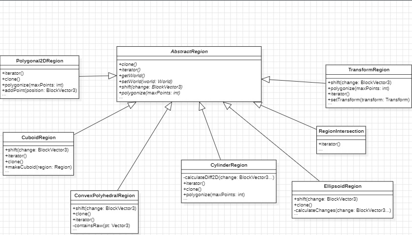

# Design Pattern 1 (Template)

## 1. Code snippet:

### AbstractRegion.java
    public abstract class AbstractRegion implements Region {

    protected World world;

    public AbstractRegion(World world) {
        this.world = world;
    }

    @Override
    public Vector3 getCenter() {
        return getMinimumPoint().add(getMaximumPoint()).toVector3().divide(2);
    }

    /**
     * Get the iterator.
     *
     * @return iterator of points inside the region
     */
    @Override
    public Iterator<BlockVector3> iterator() {
        return new RegionIterator(this);
    }

    @Override
    public World getWorld() {
        return world;
    }

    @Override
    public void setWorld(World world) {
        this.world = world;
    }

    @Override
    public void shift(BlockVector3 change) throws RegionOperationException {
        expand(change);
        contract(change);
    }

    @Override
    public AbstractRegion clone() {
        try {
            return (AbstractRegion) super.clone();
        } catch (CloneNotSupportedException exc) {
            return null;
        }
    }

    @Override
    public List<BlockVector2> polygonize(int maxPoints) {
        if (maxPoints >= 0 && maxPoints < 4) {
            throw new IllegalArgumentException("Cannot polygonize an AbstractRegion with no overridden polygonize method into less than 4 points.");
        }

        final BlockVector3 min = getMinimumPoint();
        final BlockVector3 max = getMaximumPoint();

        final List<BlockVector2> points = new ArrayList<>(4);

        points.add(BlockVector2.at(min.x(), min.z()));
        points.add(BlockVector2.at(min.x(), max.z()));
        points.add(BlockVector2.at(max.x(), max.z()));
        points.add(BlockVector2.at(max.x(), min.z()));

        return points;
    }
    //other methods and fields
    }

### CuboidRegion.java
    public class CuboidRegion extends AbstractRegion implements FlatRegion {

    private BlockVector3 pos1;
    private BlockVector3 pos2;

    /**
     * Construct a new instance of this cuboid using two corners of the cuboid.
     *
     * @param pos1 the first position
     * @param pos2 the second position
     */
    public CuboidRegion(BlockVector3 pos1, BlockVector3 pos2) {
        this(null, pos1, pos2);
    }

    /**
     * Construct a new instance of this cuboid using two corners of the cuboid.
     *
     * @param world the world
     * @param pos1  the first position
     * @param pos2  the second position
     */
    public CuboidRegion(World world, BlockVector3 pos1, BlockVector3 pos2) {
        super(world);
        checkNotNull(pos1);
        checkNotNull(pos2);
        this.pos1 = pos1;
        this.pos2 = pos2;
        recalculate();
    }

    /**
     * Get the first cuboid-defining corner.
     *
     * @return a position
     */
    public BlockVector3 getPos1() {
        return pos1;
    }
    @Override
    public void shift(BlockVector3 change) throws RegionOperationException {
        pos1 = pos1.add(change);
        pos2 = pos2.add(change);

        recalculate();
    }

    @Override
    public Set<BlockVector2> getChunks() {
        Set<BlockVector2> chunks = new HashSet<>();

        BlockVector3 min = getMinimumPoint();
        BlockVector3 max = getMaximumPoint();

        for (int x = min.x() >> ChunkStore.CHUNK_SHIFTS; x <= max.x() >> ChunkStore.CHUNK_SHIFTS; ++x) {
            for (int z = min.z() >> ChunkStore.CHUNK_SHIFTS; z <= max.z() >> ChunkStore.CHUNK_SHIFTS; ++z) {
                chunks.add(BlockVector2.at(x, z));
            }
        }

        return chunks;
    }
    @Override
    public Iterator<BlockVector3> iterator() {
        return new Iterator<BlockVector3>() {
            private final BlockVector3 min = getMinimumPoint();
            private final BlockVector3 max = getMaximumPoint();
            private int nextX = min.x();
            private int nextY = min.y();
            private int nextZ = min.z();

            @Override
            public boolean hasNext() {
                return (nextX != Integer.MIN_VALUE);
            }

            @Override
            public BlockVector3 next() {
                if (!hasNext()) {
                    throw new NoSuchElementException();
                }
                BlockVector3 answer = BlockVector3.at(nextX, nextY, nextZ);
                if (++nextX > max.x()) {
                    nextX = min.x();
                    if (++nextZ > max.z()) {
                        nextZ = min.z();
                        if (++nextY > max.y()) {
                            nextX = Integer.MIN_VALUE;
                        }
                    }
                }
                return answer;
            }
        };
    }
    // other methods and fields
    }

### ConvexPolyhedralRegion.java

    public class ConvexPolyhedralRegion extends AbstractRegion {

    /**
     * Vertices that are contained in the convex hull.
     */
    private final Set<BlockVector3> vertices = new LinkedHashSet<>();

    /**
     * Triangles that form the convex hull.
     */
    private final List<Triangle> triangles = new ArrayList<>();

    /**
     * Vertices that are coplanar to the first 3 vertices.
     */
    private final Set<BlockVector3> vertexBacklog = new LinkedHashSet<>();

    /**
     * Minimum point of the axis-aligned bounding box.
     */
    private BlockVector3 minimumPoint;
    
    //other methods and fields
    
    @Override
    public void shift(BlockVector3 change) throws RegionOperationException {
        Vector3 vec = change.toVector3();
        shiftCollection(vertices, change);
        shiftCollection(vertexBacklog, change);

        for (int i = 0; i < triangles.size(); ++i) {
            final Triangle triangle = triangles.get(i);

            final Vector3 v0 = vec.add(triangle.getVertex(0));
            final Vector3 v1 = vec.add(triangle.getVertex(1));
            final Vector3 v2 = vec.add(triangle.getVertex(2));

            triangles.set(i, new Triangle(v0, v1, v2));
        }

        minimumPoint = change.add(minimumPoint);
        maximumPoint = change.add(maximumPoint);
        centerAccum = change.multiply(vertices.size()).add(centerAccum);
        lastTriangle = null;
    }
    
    //other methods and fields
    
    @Override
    public AbstractRegion clone() {
        return new ConvexPolyhedralRegion(this);
    }
    }

## 2. Class diagram:

## 3. Location on the codebase:

- **Package:** com.sk89q.worldedit.regions
- **Class:** ` AbstractRegion, ConvexPolyhedralRegion, CuboidRegion, CylinderRegion, EllipsoidRegion, Polygonal2DRegion, RegionIntersection, TransformRegion`
- **Fields and Methods:** ` clone(), iterator(), getWorld(), setWorld(World world), shift(BlockVector3 change), polygonize(int maxPoints) ...`

## 4. Discussion:

The AbstractRegion class provides a base implementation for Region objects, establishing common behaviors and methods like getCenter, iterator, getVolume, and getChunks.
The other classes extend AbstractRegion, implementing these specific methods.

# Design Pattern 2 (Adapter)

## 1. Code snippet:
    
### FabricWorld.java
    public class FabricWorld extends AbstractWorld {

    private static final RandomSource random = RandomSource.create();

    private static ResourceLocation getDimensionRegistryKey(Level world) {
        return Objects.requireNonNull(world.getServer(), "server cannot be null")
            .registryAccess()
            .registryOrThrow(Registries.DIMENSION_TYPE)
            .getKey(world.dimensionType());
    }

    private final WeakReference<Level> worldRef;
    private final FabricWorldNativeAccess worldNativeAccess;

    /**
     * Construct a new world.
     *
     * @param world the world
     */
    FabricWorld(Level world) {
        checkNotNull(world);
        this.worldRef = new WeakReference<>(world);
        this.worldNativeAccess = new FabricWorldNativeAccess(worldRef);
    }

    /**
     * Get the underlying handle to the world.
     *
     * @return the world
     * @throws RuntimeException thrown if a reference to the world was lost (i.e. world was unloaded)
     */
    public Level getWorld() {
        Level world = worldRef.get();
        if (world != null) {
            return world;
        } else {
            throw new RuntimeException("The reference to the world was lost (i.e. the world may have been unloaded)");
        }
    }

    //other methods and fields

    @Override
    public int getBlockLightLevel(BlockVector3 position) {
        checkNotNull(position);
        return getWorld().getMaxLocalRawBrightness(FabricAdapter.toBlockPos(position));
    }

    @Override
    public boolean clearContainerBlockContents(BlockVector3 position) {
        checkNotNull(position);

        BlockEntity tile = getWorld().getBlockEntity(FabricAdapter.toBlockPos(position));
        if ((tile instanceof Clearable)) {
            ((Clearable) tile).clearContent();
            return true;
        }
        return false;
    }
    //other methods and fields
    
### FabricAdapter.java

    public final class FabricAdapter {

    private FabricAdapter() {
    }

    public static World adapt(net.minecraft.world.level.Level world) {
        return new FabricWorld(world);
    }

    /**
     * Create a Fabric world from a WorldEdit world.
     *
     * @param world the WorldEdit world
     * @return a Fabric world
     */
    public static net.minecraft.world.level.Level adapt(World world) {
        checkNotNull(world);
        if (world instanceof FabricWorld) {
            return ((FabricWorld) world).getWorld();
        } else {
            // TODO introduce a better cross-platform world API to match more easily
            throw new UnsupportedOperationException("Cannot adapt from a " + world.getClass());
        }
    }

    public static Biome adapt(BiomeType biomeType) {
        return FabricWorldEdit.getRegistry(Registries.BIOME)
            .get(ResourceLocation.parse(biomeType.id()));
    }

    public static BiomeType adapt(Biome biome) {
        ResourceLocation id = FabricWorldEdit.getRegistry(Registries.BIOME).getKey(biome);
        Objects.requireNonNull(id, "biome is not registered");
        return BiomeTypes.get(id.toString());
    }
    //other methods and fields

## 2. Class diagram:

## 3. Location on the codebase:

- **Package:** com.sk89q.worldedit.fabric
- **Class:** FabricWorld, FabricAdapter
- **Fields and Methods:** adapt(World world) adapts a WorldEdit World object to a Fabric Level object...

## 4. Discussion:
    An adapter to Minecraft worlds for WorldEdit. The FabricAdapter class provides methods to adapt various objects from one API to another, such as World, Biome, Vector3, BlockState, and more. These methods convert objects between WorldEdit representations (e.g., World, BlockState, Vector3) and Minecraft’s Fabric API representations

# Design Pattern 3 (...)

## 1. Code snippet:

    ...

## 2. Class diagram:

    ...

## 3. Location on the codebase:

- **Package:** ...
- **Class:** ...
- **Fields and Methods:** ...

## 4. Discussion:

    ...

