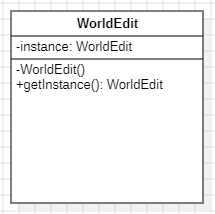

# Design Pattern 1 (Singleton)

## 1. Code snippet:

    public final class WorldEdit {
        
        private static final WorldEdit instance = new WorldEdit();
        
        // Private constructor prevents instantiation from other classes
        private WorldEdit() {
            // Initialize other components here
        }
        
        // Static method to provide the single instance of WorldEdit
        public static WorldEdit getInstance() {
            return instance;
        }
        
        // Other methods and fields
    }

## 2. Class diagram:

## 3. Location on the codebase:

- **Package:** `com.sk89q.worldedit`
- **Class:** `WorldEdit`
- **Fields and Methods:**
    - `private static final WorldEdit instance` – Defines the single instance.
    - `private WorldEdit()` – Private constructor restricts instantiation.
    - `public static WorldEdit getInstance()` – Provides access to the instance.

## 4. Discussion:

The Singleton pattern is identifiable here because `WorldEdit` restricts instantiation to a single object accessible across the application.  
This is achieved through a **private static instance** and a **private constructor** that prevents additional instantiations.  
The `getInstance()` method ensures that any part of the code accessing `WorldEdit` will use this single instance.  
Singleton is ideal here because WorldEdit manages game-wide resources and settings, and multiple instances could cause inconsistencies or unexpected behavior across the application.  
On the other hand, note that this implementation *lacks lazy initialization*, which could cause the program to be less efficient.

