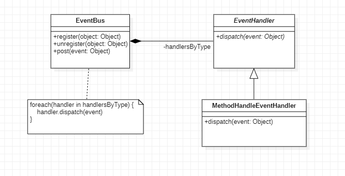

# Design Pattern 1 (Singleton)

## 1. Code snippet:

    public final class WorldEdit {
        
        private static final WorldEdit instance = new WorldEdit();
        
        // Private constructor prevents instantiation from other classes
        private WorldEdit() {
            // Initialize other components here
        }
        
        // Static method to provide the single instance of WorldEdit
        public static WorldEdit getInstance() {
            return instance;
        }
        
        // Other methods and fields
    }

## 2. Class diagram:

## 3. Location on the codebase:

- **Package:** `com.sk89q.worldedit`
- **Class:** `WorldEdit`
- **Fields and Methods:**
    - `private static final WorldEdit instance` – Defines the single instance.
    - `private WorldEdit()` – Private constructor restricts instantiation.
    - `public static WorldEdit getInstance()` – Provides access to the instance.

## 4. Discussion:

The Singleton pattern is identifiable here because `WorldEdit` restricts instantiation to a single object accessible across the application.  
This is achieved through a **private static instance** and a **private constructor** that prevents additional instantiations.  
The `getInstance()` method ensures that any part of the code accessing `WorldEdit` will use this single instance.  
Singleton is ideal here because WorldEdit manages game-wide resources and settings, and multiple instances could cause inconsistencies or unexpected behavior across the application.  
On the other hand, note that this implementation *lacks lazy initialization*, which could cause the program to be less efficient.

# Design Pattern 2 (Observer)

## 1. Code snippet:

### EventBus (Subject Class):

    public final class EventBus {

        private final SetMultimap<Class<?>, EventHandler> handlersByType = HashMultimap.create();

        // Registers the given handler for the given class to receive events. 
        // (attach Observers)
        public void subscribeAll(Multimap<Class<?>, EventHandler> handlers) {
            checkNotNull(handlers);
            lock.writeLock().lock();
            try {
                handlersByType.putAll(handlers);
            } finally {
                lock.writeLock().unlock();
            }
        }

        // Registers all handler methods on object to receive events.
        public void register(Object object) {
            subscribeAll(finder.findAllSubscribers(object));
        }

        // Unregisters the given handlers.
        // (detach Observers)
        public void unsubscribeAll(Multimap<Class<?>, EventHandler> handlers) {
            checkNotNull(handlers);
            lock.writeLock().lock();
            try {
                for (Map.Entry<Class<?>, Collection<EventHandler>> entry : handlers.asMap().entrySet()) {
                    handlersByType.get(entry.getKey()).removeAll(entry.getValue());
                }
            } finally {
                lock.writeLock().unlock();
            }
        }

        // Unregisters all handler methods on a registered object.
        public void unregister(Object object) {
            unsubscribeAll(finder.findAllSubscribers(object));
        }

        // Posts an event to all registered handlers.
        // (notify)
        public void post(Object event) {
            List<EventHandler> dispatching = new ArrayList<>();
            Set<Class<?>> dispatchTypes = flattenHierarchyCache.get(event.getClass());
            
            for (Class<?> eventType : dispatchTypes) {
                Set<EventHandler> wrappers = handlersByType.get(eventType);
                if (wrappers != null && !wrappers.isEmpty()) {
                    dispatching.addAll(wrappers);
                }
            }

            for (EventHandler handler : dispatching) {
                handler.handleEvent(event); // Notify each handler
            }
        }
    }

### EventHandler (Abstract Observer Class):

    public abstract class EventHandler implements Comparable<EventHandler> {

        // (update)
        public abstract void dispatch(Object event) throws Exception;
    }

### MethodHandleEventHandler (Concrete Observer Class):

    public class MethodHandleEventHandler extends EventHandler {

        private final MethodHandle methodHandle;

        protected MethodHandleEventHandler(Priority priority, Object object, MethodHandle methodHandle, String methodName) {
            super(priority);
            this.methodHandle = methodHandle.bindTo(object).asType(MethodType.methodType(void.class, Object.class));
        }

        @Override
        public void dispatch(Object event) throws Exception {
            this.methodHandle.invokeExact(event); // Dynamic dispatch
        }
    }

## 2. Class diagram:

## 3. Location on the codebase:

- **Package:** `com.sk89q.worldedit.util.eventbus`
- **Classes and Methods:**
    - `EventBus`
        - `subscribeAll(Multimap<Class<?>, EventHandler> handlers)`: Registers the given handler for the given class to receive events.
        - `register(Object object)`: Calls `subscribeAll` to register all handler methods on object.
        - `unsubscribeAll(Multimap<Class<?>, EventHandler> handlers)`: Unregisters the given handlers.
        - `unregister(Object object)`: Calls `unsubscribeAll` to unregister all handler methods on a registered object.
        - `post(Object event)`: Notifies all registered event handlers.
    - `EventHandler`
        - `dispatch(Object event)`: Abstract method, implemented by subclasses.
        - `handleEvent(Object event)`: Calls `dispatch` to handle the event.
    - `MethodHandleEventHandler`
        - `dispatch(Object event)`: Implements event handling with `MethodHandle`.

## 4. Discussion:

This implementation demonstrates the Observer pattern by allowing `EventBus` to act as the **Subject** that notifies multiple observers (`EventHandler` instances) about specific events.  
The `EventHandler` class, as an **abstract observer**, defines how events should be processed, while the `MethodHandleEventHandler` provides a **concrete implementation** that uses dynamic invocation to handle events.  
This structure supports flexibility and modularity, allowing various observers to respond to events in their own ways without modifying the `EventBus`.

