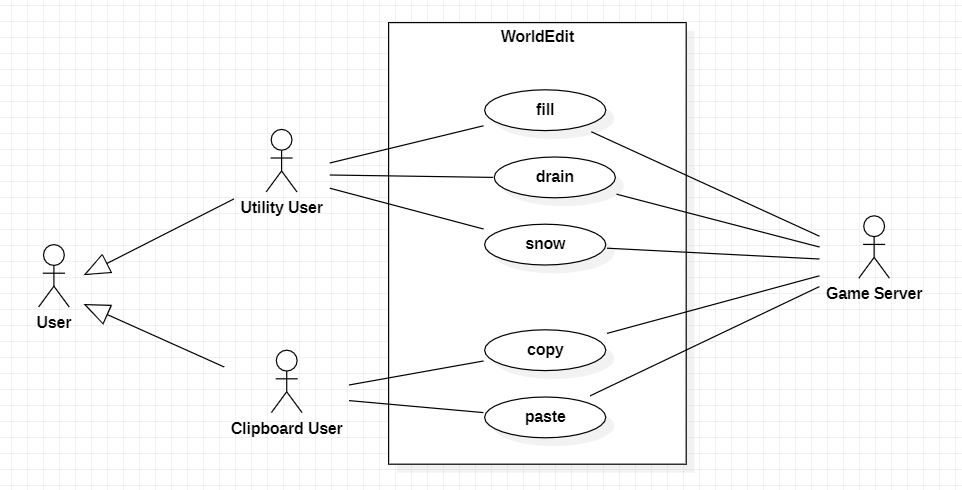

## **Utility Commands**

1. **Use Case Name**: fill

    - **Use Case Description**: Fills holes within a given area, to a specified depth (fills holes with a specified block).
    - **Primary Actor**: **Utility User**
    - **Secondary Actor**: **Game Server**

2. **Use Case Name**: drain

    - **Use Case Description**: Drains water within a certain radius (removes water blocks within the radius).
    - **Primary Actor**: **Utility User**
    - **Secondary Actor**: **Game Server**

3. **Use Case Name**: snow

    - **Use Case Description**: Simulates snow (puts snow particles in a determined cylinder).
    - **Primary Actor**: **Utility User**
    - **Secondary Actor**: **Game Server**

## **Schematic and Clipboard Commands**

4. **Use Case Name**: copy

    - **Use Case Description**: Copy the world selection to the clipboard.
    - **Primary Actor**: **Clipboard User**
    - **Secondary Actor**: **Game Server**

5. **Use Case Name**: paste

    - **Use Case Description**: Paste the clipboard’s contents into the world.
    - **Primary Actor**: **Clipboard User**
    - **Secondary Actor**: **Game Server**

## **Use Case Diagram**

