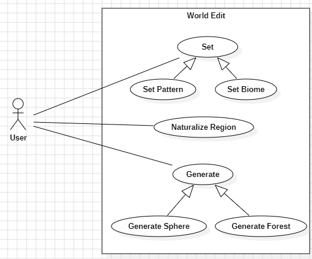

## **Region Commands**

1. **Use Case Name**: Set Pattern

   - **Use Case Description**: The player changes an area of blocks in a selection to specific patterns. 
   - **Primary Actor**: **User**
   - **Secondary Actor**: **Game Server**

2. **Use Case Name**: Naturalize Region

   - **Use Case Description**: The user naturalizes terrain by creating a layer of grass, followed by layers of dirt and then stone.
   - **Primary Actor**: **User**
   - **Secondary Actor**: **Game Server**
   
3. **Use Case Name**: Set Biome

   - **Use Case Description**: The user sets the biome in their selection.
   - **Primary Actor**: **User**
   - **Secondary Actor**: **Game Server**

## **Generation Commands**

1. **Use Case Name**: Generate Sphere

   - **Use Case Description**: The user generates a sphere at a given position with a given size.
   - **Primary Actor**: **User**
   - **Secondary Actor**: **Game Server**

2. **Use Case Name**: Generate Forest

   - **Use Case Description**: The user generates a forest with a given size, type and density.
   - **Primary Actor**: **User**
   - **Secondary Actor**: **Game Server**

## **Use Case Diagram**

