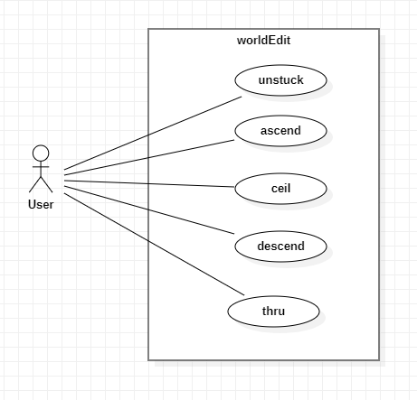

## **History Commands**

1. **Use Case Name**: unstuck

    - **Use Case Description**: Escape from being stuck inside a block.
    - **Primary Actor**: **User**
    - **Secondary Actor**: **None**

2. **Use Case Name**: ascend

    - **Use Case Description**: Go down a floor.
    - **Primary Actor**: **User**
    - **Secondary Actor**: **None**

3. **Use Case Name**: descend

    - **Use Case Description**: Go to the ceiling.
    - **Primary Actor**: **User**
    - **Secondary Actor**: **None**

4. **Use Case Name**: ceil

    - **Use Case Description**: Go to the ceiling.
    - **Primary Actor**: **User**
    - **Secondary Actor**: **None**

5. **Use Case Name**: thru

    - **Use Case Description**: Go to the ceiling.
    - **Primary Actor**: **User**
    - **Secondary Actor**: **None**

## **Use Case Diagram**
