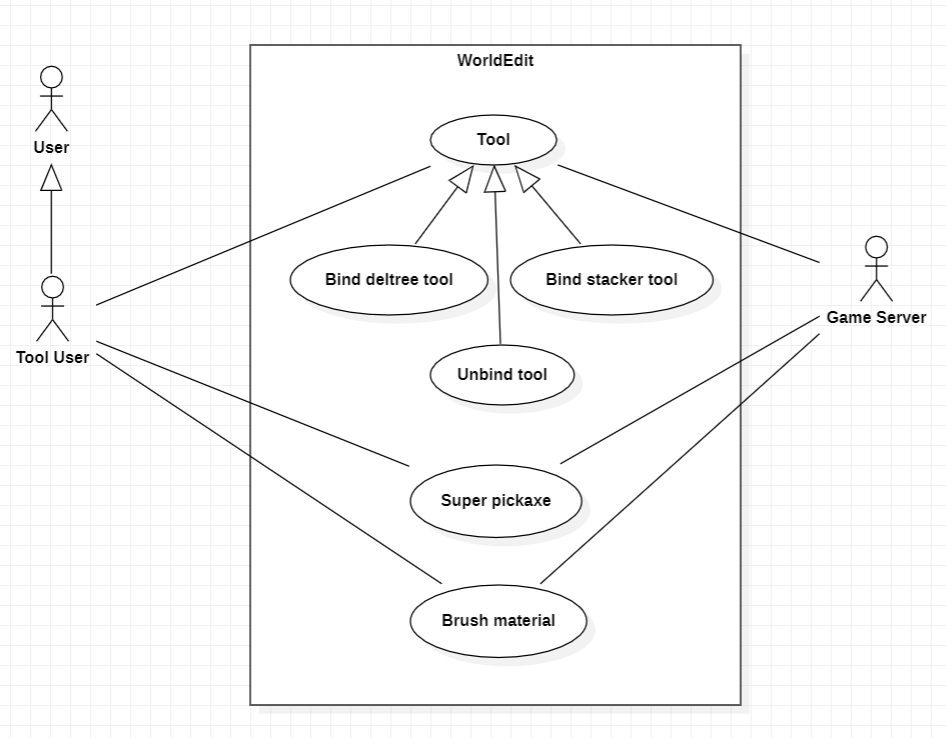

# Use Cases

## **Tool Commands**

1. **Use Case Name**: Bind deltree tool

    - **Use Case Description**: The user binds the floating tree remover tool to the item in their hand.
    - **Primary Actor**: **User**
    - **Secondary Actor**: **Game Server**

2. **Use Case Name**: Bind stacker tool

    - **Use Case Description**: The user binds the stacker tool to the item in their hand.
    - **Primary Actor**: **User**
    - **Secondary Actor**: **Game Server**

3. **Use Case Name**: Unbind tool

    - **Use Case Description**: The user unbinds a bound tool from their current item.
    - **Primary Actor**: **User**
    - **Secondary Actor**: **Game Server**

4. **Use Case Name**: Super pickaxe

    - **Use Case Description**: The user toggles the super pickaxe function on or off.
    - **Primary Actor**: **User**
    - **Secondary Actor**: **Game Server**

5. **Use Case Name**: Brush material

    - **Use Case Description**: The user sets the brush material.
    - **Primary Actor**: **User**
    - **Secondary Actor**: **Game Server**

## **Use Case Diagram**

