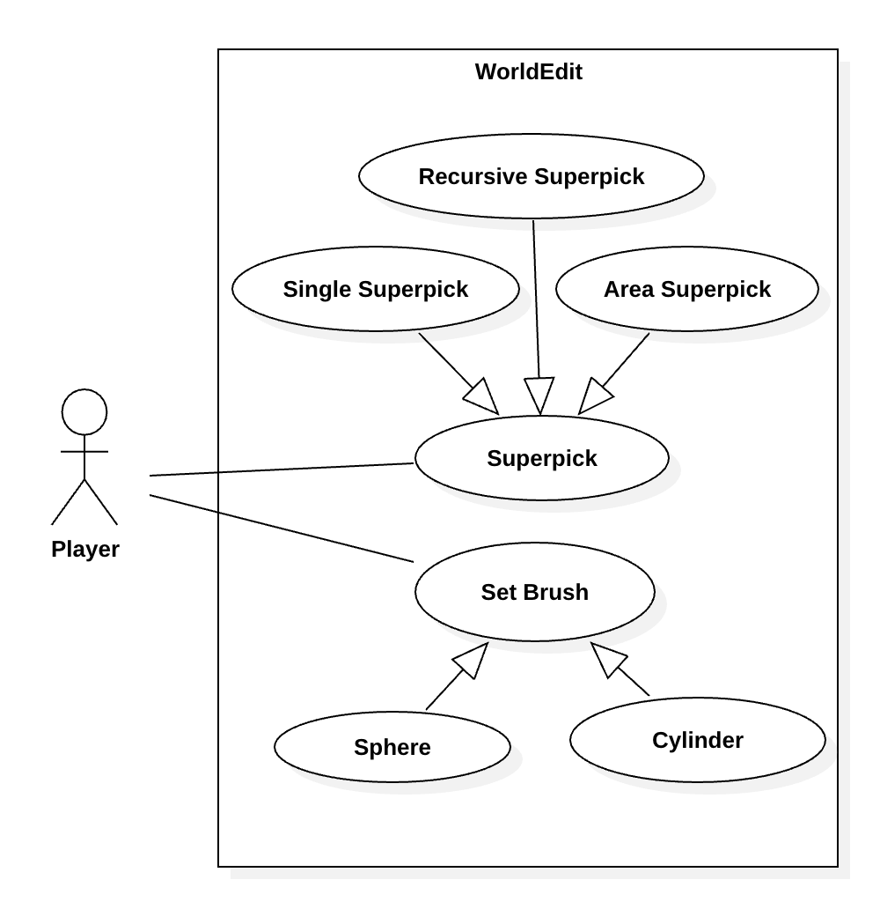

# Super-pickaxes

## Single Superpick

- **Description:** Instantly breaks blocks with a pickaxe when toggled on, with optional item drops, until toggled off.

- **Primary actors:** Player

- **Secondary actor:** None.

## Area Superpick

- **Description:** Instantly break all blocks of the same type within a specified radius with a pickaxe, with optional item drops, until toggled off.

- **Primary Actor:** Player

- **Secondary Actor:** None.

## Recursive Superpick

- **Description:** Instantly break all connected blocks of the same type within a specified radius with a pickaxe, with optional item drops, until toggled off.

- **Primary Actor:** Player

- **Secondary Actor:** None.

# Brush Listing

## Sphere Brush

- **Description:** Creates a sphere at the target point with a specified pattern and radius. The sphere can be hollow.

- **Primary Actor:** Player

- **Secondary Actor:** None.

## Cylinder Brush

- **Description:** Creates a cylinder at the target point with a specified pattern, radius, and height. The cylinder can be hollow.

- **Primary Actor:** Player

- **Secondary Actor:** None.

