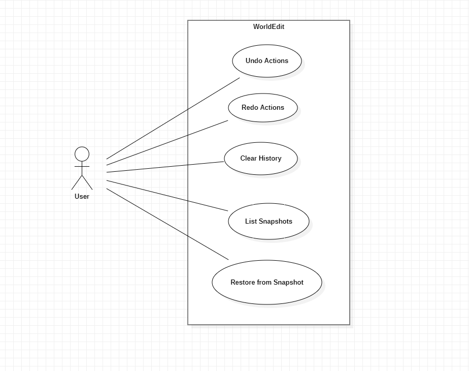

## **History Commands**

1. **Use Case Name**: Undo Actions

   - **Use Case Description**: The user undoes the last or a specified number of past actions from their or a specified player session history.
   - **Primary Actor**: **User**
   - **Secondary Actor**: **Game Server**

2. **Use Case Name**: Redo Actions

   - **Use Case Description**: The user redoes the last or a specified number of undone actions from their or a specified player session history.
   - **Primary Actor**: **User**
   - **Secondary Actor**: **Game Server**
   
3. **Use Case Name**: Clear History

   - **Use Case Description**: The user clears their action history, removing all previous actions from the session.
   - **Primary Actor**: **User**
   - **Secondary Actor**: **None**

## **Snapshot Commands**

1. **Use Case Name**: List Snapshots

   - **Use Case Description**: The user lists all snapshots available for their current world.
   - **Primary Actor**: **User**
   - **Secondary Actor**: **None**

2. **Use Case Name**: Restore from Snapshot

   - **Use Case Description**: The user restores a selected area from the most recent backup for their current world.
   - **Primary Actor**: **User**
   - **Secondary Actor**: **Game Server**

## **Use Case Diagram**

