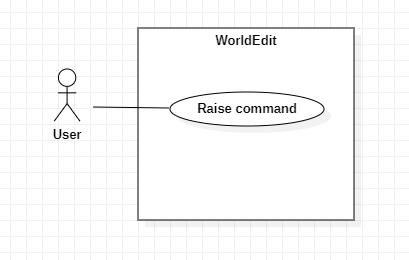
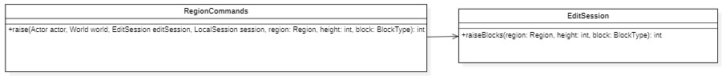

## Use Cases
| Use Case: Raise a certain blocks in a region by a specific height                                                                                                                                                                                                                                                                                                                                                           |
|-----------------------------------------------------------------------------------------------------------------------------------------------------------------------------------------------------------------------------------------------------------------------------------------------------------------------------------------------------------------------------------------------------------------------------|
| **ID**: 1                                                                                                                                                                                                                                                                                                                                                                                                                   |
| **Brief Description**: The system raises all blocks of the chosen type by the chosen height.                                                                                                                                                                                                                                                                                                                             |
| **Primary Actors**: User                                                                                                                                                                                                                                                                                                                                                                                                 |
| **Secondary Actors**: Game System                                                                                                                                                                                                                                                                                                                                                                                        |
| **Preconditions**: 1. Two positions are set by the user.                                                                                                                                                                                                                                                                                                                                                                 |
| **Main flow**: 1. The user selects two positions in the world (the first with a left click and the second with a right click). 2. The user types the `//raise` command with the desired height to raise including the block type that should be raised. 3. The system checks for the blocks we want to raise in the region. 4. The system places height number of blocks above the blocks of the type selected. |
| **Post conditions**: 1. The chosen blocks have height number of blocks above them.                                                                                                                                                                                                                                                                                                                                       |
| **Alternative Flows**: InvalidBlock InvalidRegion InvalidHeight                                                                                                                                                                                                                                                                                                                                                    |

## Alternative Flows
| Alternative Flow: InvalidBlock                                                                                                                                                                                      |
|---------------------------------------------------------------------------------------------------------------------------------------------------------------------------------------------------------------------|
| **ID**: 1.1                                                                                                                                                                                                         |
| **Brief Description**: The system informs the user that the block type is invalid.                                                                                                                               |
| **Primary Actors**: User                                                                                                                                                                                         |
| **Secondary Actors**: Game System                                                                                                                                                                                |
| **Preconditions**: 1. The user specifies an unrecognized block type to the `//raise` command.                                                                                                                    |
| **Alternative flow**: 1. The alternative flow begins after step 1 of the main flow. 2. The user selects an invalid block type. 3. The system detects the invalid block type and displays an error message. |
| **Post conditions:** None.                                                                                                                                                                                       |

| Alternative Flow: InvalidRegion                                                                                                                                                                                                                                 |
|-----------------------------------------------------------------------------------------------------------------------------------------------------------------------------------------------------------------------------------------------------------------|
| **ID**: 1.2                                                                                                                                                                                                                                                     |
| **Brief Description**: The system informs the user that the region chosen is invalid.                                                                                                                                                                        |
| **Primary Actors**: User                                                                                                                                                                                                                                     |
| **Secondary Actors**: Game System                                                                                                                                                                                                                            |
| **Preconditions**: 1. The user selects an invalid number of positions (0 or 1) for the region.                                                                                                                                                               |
| **Alternative flow**: 1. The user selects 0 or 1 positions. 2. The user types the `//raise` command with the desired height to raise including the block type that should be raised. 3. The system informs the user that the region chosen is invalid. |
| **Post conditions:** None.                                                                                                                                                                                                                                   |

| Alternative Flow: InvalidHeight                                                                                                                                                                                                            |
|--------------------------------------------------------------------------------------------------------------------------------------------------------------------------------------------------------------------------------------------|
| **ID**: 1.3                                                                                                                                                                                                                                |
| **Brief Description**: The system informs the user that the height chosen is invalid.                                                                                                                                                   |
| **Primary Actors**: User                                                                                                                                                                                                                |
| **Secondary Actors**: Game System                                                                                                                                                                                                       |
| **Preconditions**: 1. The user gives a zero or negative height to the `//raise` command.                                                                                                                                                |
| **Alternative flow**: 1. The alternative flow begins after step 1 of the main flow. 2. The user gives a zero or negative height to the `//raise` command. 3. The system detects the invalid height and displays an error message. |
| **Post conditions:** None.                                                                                                                                                                                                              |

## Use Case Diagram

## Sequence Diagram

## Class Diagram

