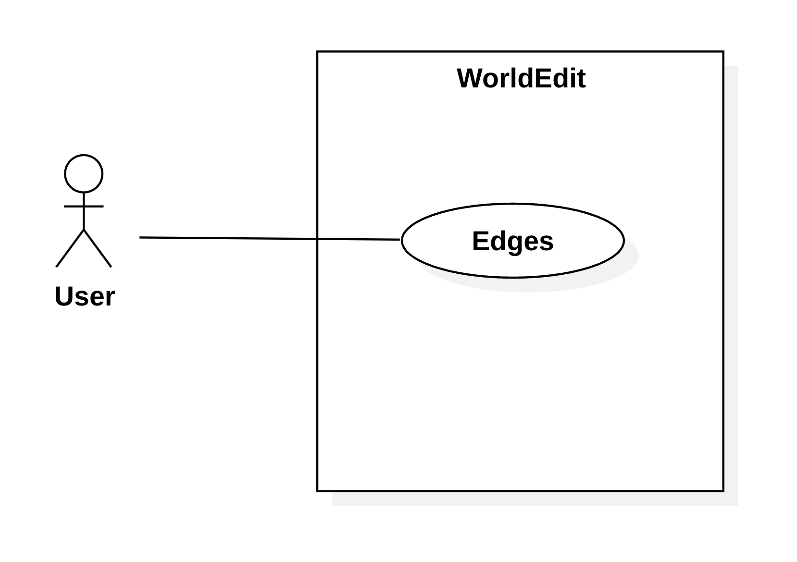

## Use Cases
| Use Case: Fill Edges of a Cuboid Region                                                                                                                                                                                                                                                                                                                                                                                                                                                                                       |
| ----------------------------------------------------------------------------------------------------------------------------------------------------------------------------------------------------------------------------------------------------------------------------------------------------------------------------------------------------------------------------------------------------------------------------------------------------------------------------------------------------------------------------- |
| **ID**: 1                                                                                                                                                                                                                                                                                                                                                                                                                                                                                                                     |
| **Brief Description**: The system fills the edges of a cuboid region and optionally fills specific faces.                                                                                                                                                                                                                                                                                                                                                                                                                  |
| **Primary Actors**: User                                                                                                                                                                                                                                                                                                                                                                                                                                                                                                   |
| **Secondary Actors**: Game System                                                                                                                                                                                                                                                                                                                                                                                                                                                                                          |
| **Preconditions**: 1. Two positions are set by the user.                                                                                                                                                                                                                                                                                                                                                                                                                                                                   |
| **Main flow**: 1. The user selects two positions in the world (the first with a left click and the second with a right click).   2. The user types the `//edges` command including the block type and, optionally, including flags to fill specific faces.   3. The system calculates the edges of the region based on the two positions.   4. The edges of the cuboid region are filled with the selected block. 5. If flags are provided, the system also fills the specified faces with the selected block. |
| **Postconditions**: 1. The edges of the cuboid region defined by the two positions are filled with the specified block. 2. The faces specified by the user are filled, if applicable.                                                                                                                                                                                                                                                                                                                                   |
| **Alternative Flows**: InvalidPattern InvalidRegion InvalidFlag                                                                                                                                                                                                                                                                                                                                                                                                                                                      |

## Alternative Flows
| Alternative Flow: InvalidRegion                                                                                                                               |
| ------------------------------------------------------------------------------------------------------------------------------------------------------------- |
| **ID**: 1.1                                                                                                                                                   |
| **Brief Description**: The system informs the user that the region chosen is invalid.                                                                      |
| **Primary Actors**: User                                                                                                                                   |
| **Secondary Actors**: Game System                                                                                                                          |
| **Preconditions**: 1. The user chooses an invalid number of positions (0 or 1).                                                                            |
| **Alternative flow**: 1. The alternative flow begins after step 2 of the main flow.   2. The system informs the user that the region chosen is invalid. |
| **Postconditions:** None.                                                                                                                                  |

| Alternative Flow: InvalidPattern                                                                                                                                        |
| ----------------------------------------------------------------------------------------------------------------------------------------------------------------------- |
| **ID**: 1.2                                                                                                                                                             |
| **Brief Description**: The system informs the user that the block type is invalid.                                                                                   |
| **Primary Actors**: User                                                                                                                                             |
| **Secondary Actors**: Game System                                                                                                                                    |
| **Preconditions**: 1. The user specifies an unrecognized block type.                                                                                                 |
| **Alternative flow**: 1. The alternative flow begins after step 2 of the main flow.   2. The system detects the invalid block type and displays an error message. |
| **Postconditions:** None.                                                                                                                                            |

| Alternative Flow: InvalidFlag                                                                                                                                              |
| -------------------------------------------------------------------------------------------------------------------------------------------------------------------------- |
| **ID**: 1.3                                                                                                                                                                |
| **Brief Description**: The system informs the user that the flag or flags chosen are invalid.                                                                           |
| **Primary Actors**: User                                                                                                                                                |
| **Secondary Actors**: Game System                                                                                                                                       |
| **Preconditions**: 1. The user specifies an unrecognized flag or flags.                                                                                                 |
| **Alternative flow**: 1. The alternative flow begins after step 2 of the main flow.   2. The system detects the invalid flag or flags and displays an error message. |
| **Postconditions:** None.                                                                                                                                               |

## Use Case Diagram

