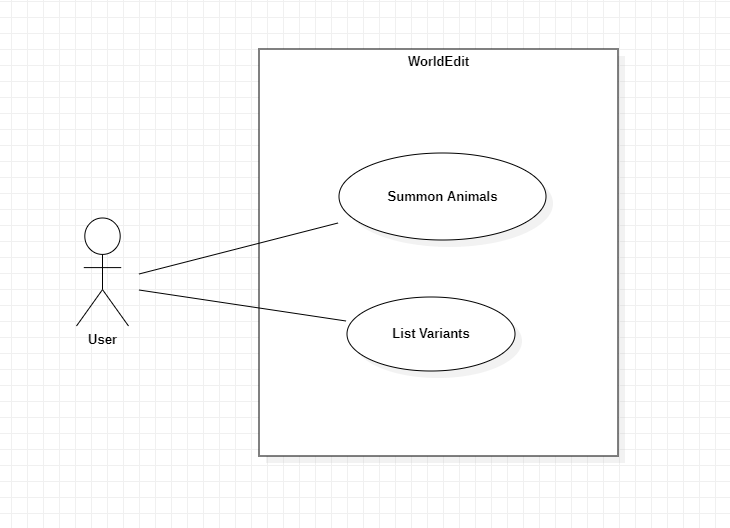

## Use Cases
| Use Case: Summon  animals                                                                                                                                                                                                                                                                                                                                                                                                                                                                                       |
| ----------------------------------------------------------------------------------------------------------------------------------------------------------------------------------------------------------------------------------------------------------------------------------------------------------------------------------------------------------------------------------------------------------------------------------------------------------------------------------------------------------------------------- |
| **ID**: 2                                                                                                                                                                                                                                                                                                                                                                                                                                                                                                                     |
| **Brief Description**: Summons one or more animals inside a specified region.                                                                                                                                                                                                                                                                                                                                                                                                                  |
| **Primary Actors**: User                                                                                                                                                                                                                                                                                                                                                                                                                                                                                                   |
| **Secondary Actors**: Game Server                                                                                                                                                                                                                                                                                                                                                                                                                                                                                          |
| **Preconditions**: 1. An area is selected.                                                                                                                                                                                                                                                                                                                                                                                                                                                                    |
| **Main flow**: 1. The use case starts when the user types `//animal` in the game chat.   &nbsp;&nbsp;&nbsp;&nbsp;1.1. The system sugests a list of available animal types for the user to select.  2. The user types or selects an animal type.  3. If nothing else is specified   &nbsp;&nbsp;&nbsp;&nbsp;3.1. The system creates one adult animal of the specified type with the default variant.   4. If an integer number is specified   &nbsp;&nbsp;&nbsp;&nbsp;4.1. The system creates the specified number of animals.   5. If the `-b` flag is used   &nbsp;&nbsp;&nbsp;&nbsp;5.1. The system creates the animal(s) in baby version.   6. If a variant is specified   &nbsp;&nbsp;&nbsp;&nbsp;6.1. The system creates the animal(s) in the specified variant.
| **Postconditions**: 1. The system creates one or more animals in a random position of the selected area.                                                                                                                                                                                                                                                                                                                                   |
| **Alternative Flows**: InvalidAnimalType InvalidArguments InvalidCount  InvalidVariant                                                                                                                                                                                                                                                                                                                                                                                                                                                     |

| Alternative Flow: Summon  animals: InvalidAnimalType                                                                                                                                |
| ------------------------------------------------------------------------------------------------------------------------------------------------------------- |
| **ID**: 2.1                                                                                                                                                   |
| **Brief Description**: The system informs the user that the chosen animal type is invalid.                                                                      |
| **Primary Actors**: User                                                                                                                                   |
| **Secondary Actors**: None.                                                                                                                          |
| **Preconditions**: 1. The user enters an invalid animal type.                                                                            |
| **Alternative flow**: 1. The alternative flow begins after step 2 of the main flow.  2. The system informs the user that the chosen animal type is invalid. |
| **Postconditions:** None.                                                                                                                                  |

| Alternative Flow: Summon  animals: InvalidArguments                                                                                                                                |
| ------------------------------------------------------------------------------------------------------------------------------------------------------------- |
| **ID**: 2.2                                                                                                                                                   |
| **Brief Description**: The system informs the user that the entered number of arguments is invalid and shows the right usage of the command.                                                                      |
| **Primary Actors**: User                                                                                                                                   |
| **Secondary Actors**: None.                                                                                                                          |
| **Preconditions**: 1. The user enters an invalid number of arguments or enters them in the wrong order.                                                                            |
| **Alternative flow**: 1. The alternative flow begins after step 1.1 of the main flow.  2. The system informs the user that the entered number of arguments is invalid and shows the right usage of the command. |
| **Postconditions:** None.                                                                                                                                  |

| Alternative Flow: Summon  animals: InvalidCount                                                                                                                                |
| ------------------------------------------------------------------------------------------------------------------------------------------------------------- |
| **ID**: 2.3                                                                                                                                                   |
| **Brief Description**: The system informs the user that the count must be a positive number.                                                                      |
| **Primary Actors**: User                                                                                                                                   |
| **Secondary Actors**: None.                                                                                                                          |
| **Preconditions**: 1. The user enters an integer number smaller than 1.                                                                            |
| **Alternative flow**: 1. The alternative flow begins after step 4 of the main flow.  2. The system informs the user that the count must be a positive number. |
| **Postconditions:** None.                                                                                                                                  |

| Alternative Flow: Summon  animals: InvalidVariant                                                                                                                                |
| ------------------------------------------------------------------------------------------------------------------------------------------------------------- |
| **ID**: 2.4                                                                                                                                                   |
| **Brief Description**: The system informs the user that the chosen animal variant is invalid.                                                                      |
| **Primary Actors**: User                                                                                                                                   |
| **Secondary Actors**: None.                                                                                                                          |
| **Preconditions**: 1. The user enters an invalid animal variant.                                                                            |
| **Alternative flow**: 1. The alternative flow begins after step 6 of the main flow.  2. The system informs the user that the chosen animal variant is invalid. |
| **Postconditions:** None.                                                                                                                                  |

| Use Case: List variants                                                                                                                                                                                                                                                                                                                                                                                                                                                                                       |
| ----------------------------------------------------------------------------------------------------------------------------------------------------------------------------------------------------------------------------------------------------------------------------------------------------------------------------------------------------------------------------------------------------------------------------------------------------------------------------------------------------------------------------- |
| **ID**: 3                                                                                                                                                                                                                                                                                                                                                                                                                                                                                                                     |
| **Brief Description**: List the variants of a specified animal type.                                                                                                                                                                                                                                                                                                                                                                                                                  |
| **Primary Actors**: User                                                                                                                                                                                                                                                                                                                                                                                                                                                                                                   |
| **Secondary Actors**: None.                                                                                                                                                                                                                                                                                                                                                                                                                                                                                          |
| **Preconditions**: None.                                                                                                                                                                                                                                                                                                                                                                                                                                                                    |
| **Main flow**: 1. The use case starts when the user types `//variants` in the game chat.   &nbsp;&nbsp;&nbsp;&nbsp;1.1. The system sugests a list of available animals for the user to select.  2. The user types or selects an animal type.  3. If nothing else is specified   &nbsp;&nbsp;&nbsp;&nbsp;3.1. The system lists, in the game chat, the available variants of the specified animal.    4. If the `-p` flag is used followed by a page number  &nbsp;&nbsp;&nbsp;&nbsp;4.1. The system shows the list begining from the specified page number. 
| **Postconditions**: 1. The system shows a list of animal variants in the game chat.                                                                                                                                                                                                                                                                                                                                   |
| **Alternative Flows**: InvalidAnimalType InvalidArguments InvalidPageNumber  AnimalWithoutVariants                                                                                                                                                                                                                                                                                                                                                                                                                                                     |

| Alternative Flow: List variants: InvalidAnimalType                                                                                                                                |
| ------------------------------------------------------------------------------------------------------------------------------------------------------------- |
| **ID**: 3.1                                                                                                                                                   |
| **Brief Description**: The system informs the user that the chosen animal type is invalid.                                                                      |
| **Primary Actors**: User                                                                                                                                   |
| **Secondary Actors**: None.                                                                                                                          |
| **Preconditions**: 1. The user enters an invalid animal type.                                                                            |
| **Alternative flow**: 1. The alternative flow begins after step 2 of the main flow.  2. The system informs the user that the chosen animal type is invalid. |
| **Postconditions:** None.                                                                                                                                  |

| Alternative Flow: List variants: InvalidArguments                                                                                                                                |
| ------------------------------------------------------------------------------------------------------------------------------------------------------------- |
| **ID**: 3.2                                                                                                                                                   |
| **Brief Description**: The system informs the user that the entered number of arguments is invalid and shows the right usage of the command.                                                                      |
| **Primary Actors**: User                                                                                                                                   |
| **Secondary Actors**: None.                                                                                                                          |
| **Preconditions**: 1. The user enters an invalid number of arguments or enters them in the wrong order.                                                                            |
| **Alternative flow**: 1. The alternative flow begins after step 1.1 of the main flow.  2. The system informs the user that the entered number of arguments is invalid and shows the right usage of the command. |
| **Postconditions:** None.                                                                                                                                  |

| Alternative Flow: List variants: InvalidPageNumber                                                                                                                                |
| ------------------------------------------------------------------------------------------------------------------------------------------------------------- |
| **ID**: 3.3                                                                                                                                                   |
| **Brief Description**: The system informs the user that the page number is invalid.                                                                      |
| **Primary Actors**: User                                                                                                                                   |
| **Secondary Actors**: None.                                                                                                                          |
| **Preconditions**: 1. The user enters an invalid page number.                                                                            |
| **Alternative flow**: 1. The alternative flow begins after step 4 of the main flow.  2. The system informs the user that the page number is invalid. |
| **Postconditions:** None.                                                                                                                                  |

| Alternative Flow: List variants: AnimalWithoutVariants                                                                                                                                |
| ------------------------------------------------------------------------------------------------------------------------------------------------------------- |
| **ID**: 3.4                                                                                                                                                   |
| **Brief Description**: The system informs the user that the chosen animal type doesn't have variants.                                                                      |
| **Primary Actors**: User                                                                                                                                   |
| **Secondary Actors**: None.                                                                                                                          |
| **Preconditions**: 1. The user enters an animal type that don't have variants.                                                                            |
| **Alternative flow**: 1. The alternative flow begins after step 3 of the main flow.  2. The system informs the user that the chosen animal type doesn't have variants. |
| **Postconditions:** None.                                                                                                                                  |

## Use Case Diagram

## Sequence Diagram

## Class Diagram

